线上形式的项目形式，调查会作为课堂表现

# 王占峰

负责：技术【面向结构编程，C ，  面向对象，C++，框架（Qt）】，辅助【配置管理，AI】，项目管理PDCA【需求，设计，编码，测试】


# 资料

钉钉：


# 考核

技术讲解【考勤+课堂表现+5天课后作业】+项目过程【考勤+过程（需求，设计，编码，单元测试，集成测试）】+ 答辩【演示，答辩】


# C基础知识

## 1	C的特性

偏向于底层开发，实现健壮性的  服务器   

C的常见标准   ANSI  ，  ISO和IEC   C11    

C的常见编译器对C标准支持会有不同【Clang   ， GCC  ，  MSVC......】

## 2	实现平台

演示：   DEV C++   IDE工具套件

实际：   linux+gcc+vi   ，      linux平台的实现可以使用（虚拟机vmware  或者   wsl【推荐】）


## 3	数据类型

数据的一种抽象方式，C常用类型      数值   ，    （字符，字符串）

存在多种类型的原因？：  节省内存空间（例如表示我今年的年龄可以使用char表示），便于进行数据处理

如何获取类型的空间大小：   sizeof  运算符    实现 ，   推荐   使用   sizeof(类型或变量名方式)

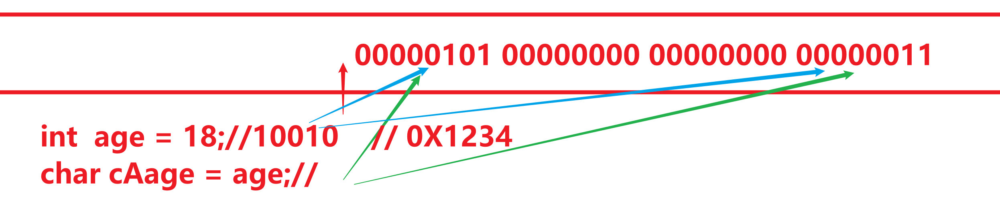


课堂演练： 15分钟【随机抽查】，实现通过程序观察各种数据类型布局状态


## 4	量

字面量： 仅表示自身   ，  除了赋值尽量少出现 【魔术数字】

变量：函数都是平等的，函数内的变量只能被该函数识别。

使用static修饰的量 ，存储在 内存的    静态区。    

C语言中，  模块通常使用文件作为分隔【file.h和file.c   ,   net.h和net.c  】【推荐阅读c中static】

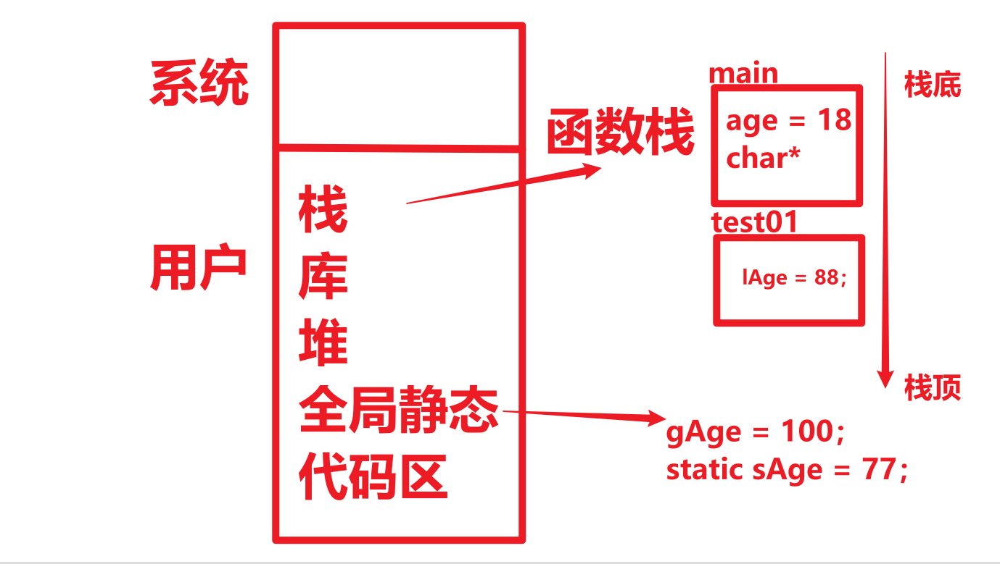

常量：推荐使用const修饰的常变量取代   #define定义的标识符变量（宏变量），多状态常量推荐使用枚举常量表示（符合语义化编程）


## 5	字符串

以一个哨兵转义字符   '\0'   结束的多个字符序列， 计算长度时不包括  '\0'     ，遇到  ‘\0’   则认为结束   

字符串中的特殊字符，可以通过  \   再次转义

课堂练习：

  


# 系统级编程

进程的管理，设备管理，文件管理

利用linux平台实现，搭建平台， 推荐使用wsl方式 （次要选择   虚拟机）

只要使用linux内核的系统都是linux操作系统（发行版）

## 1	环境安装

### 1.1	在windows平台安装   wsl，推荐wsl2 版本

https://blog.csdn.net/wojiuguowei/article/details/122100090

### 1.2	安装  ubuntu 22.04     LTS（长期支持版）

### 1.3	安装编译环境gcc + 编辑器vi(vim)  【推荐使用apt工具】

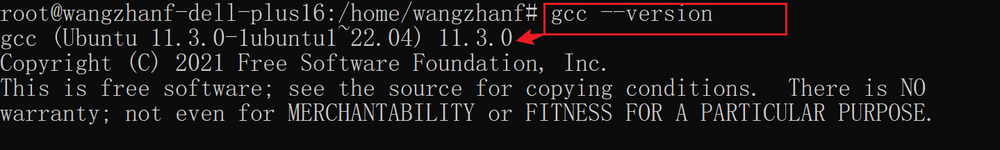

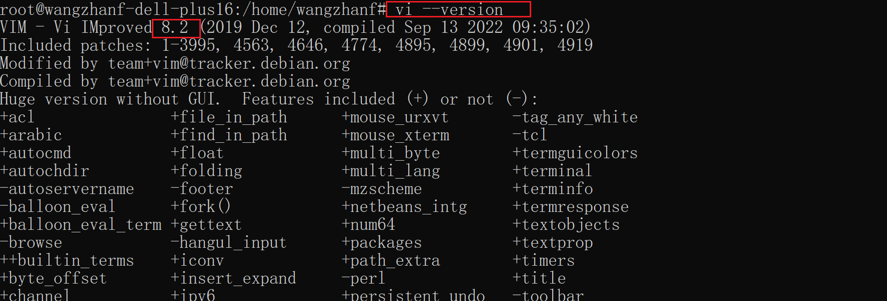

## 2	vi的使用

vi是一个字符界面的编辑器，通常使用vi的强化版本vim  ，   vi是linux通用编辑器  【通过apt   inatll   vim安装】

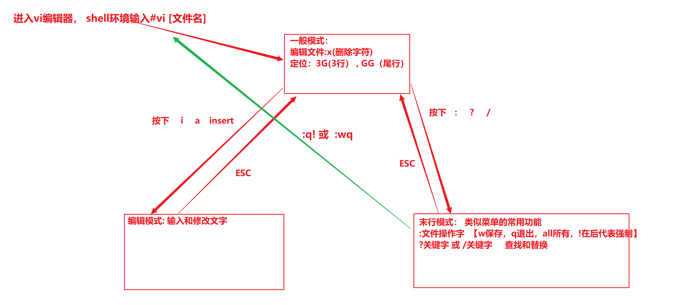

一般模式下：   dd剪切 ，yy复制     ，加上数字   4yy   复制4行   ，   p粘贴

### 3	gcc基本使用

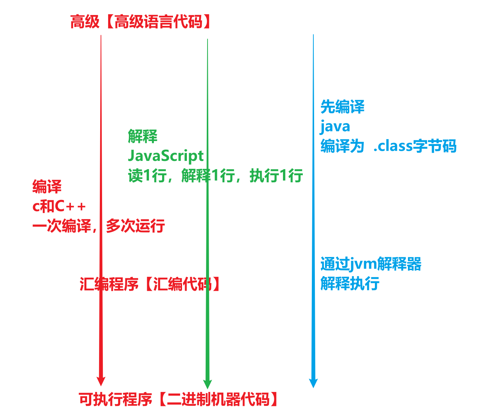


gcc GNU编译套件，包含完整的开源的工具（cpp，ccl，as，ld.........）, gcc 是一个前端框架

gcc编译C的过程：  

预处理：  引入包含头和宏展开，空白压缩  ， 使用预处理器  cpp  【gcc的 -E 选项】， 一般.i结尾

编译：产生对应的汇编代码，  使用   ccl   【gcc的-S选项】，一般.s结尾

汇编：使用汇编器 as 转换为二进制目标程序【gcc -c选项】，一般.o结尾

链接：通过关联库回填函数地址形成正确的调用 关系  ，ld完成   【gcc默认完成】    

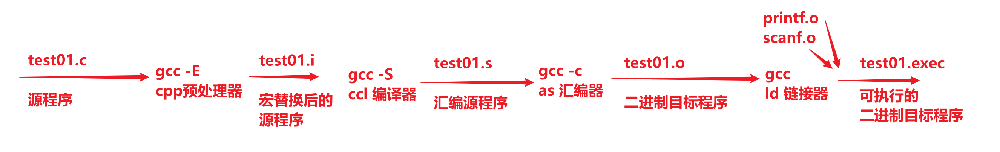

gcc常见选项：

-o文件名      ：     指定输出的文件

-I目录名	   ：	将目录加入到**头**的搜索路径

-L目录名      ：    将目录加入**库**的搜索路径中

推荐的开发思路：   做到 松耦合 、高内聚   ，声明和定义分离，  将保护的模块通过.o进行共享


### 4	开发结构的搭建

#### 4.1	创建公用库的源文件

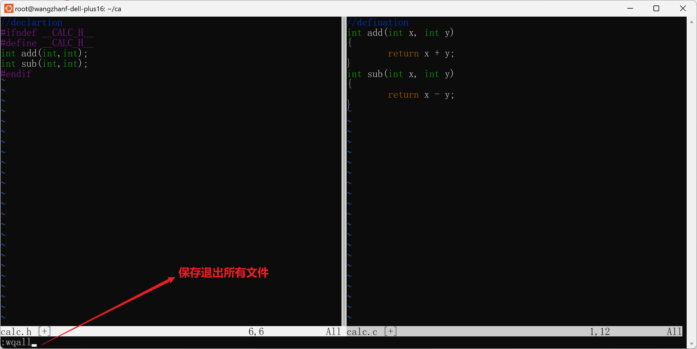

#### 4.2	编译公用库文件

gcc -c calc.c -o calc.o

也可以通过   ar  rcs   libcalc.a  calc.o     将  目标库打包为静态库.a文件   

#### 4.3	创建项目结构

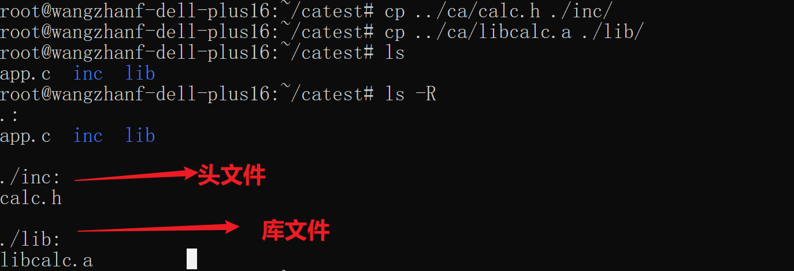

#### 4.4	编译程序时使用库

gcc -I ./inc  app.c ./lib/libcalc.a -o app.exec


## 5	文件

linux一切皆文件，设备是文件【输入输出，网卡】

文件除了内容之外，还有一些管理方面的属性信息（时间，权限）

如何查看文件：

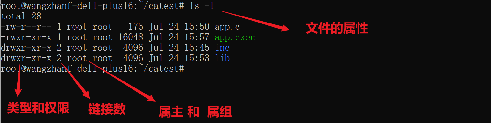

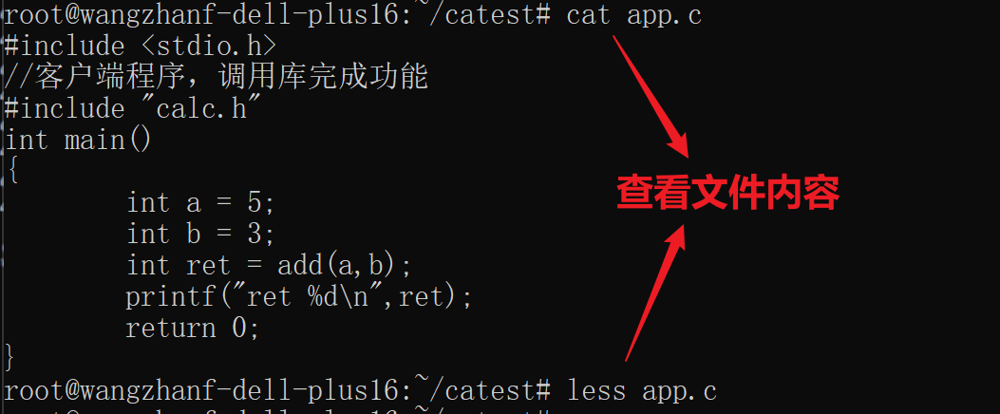

#### 5.1	文件的结构

可以通过    ls    -i      查看inode信息，文件的属性都被保存在inode结构体，系统获取inode节点编号识别，文件的内容存放在  block中

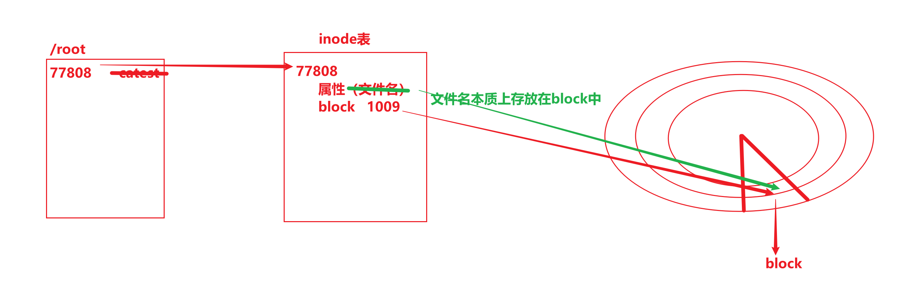

### 5.2	使用系统调用进行文件操作

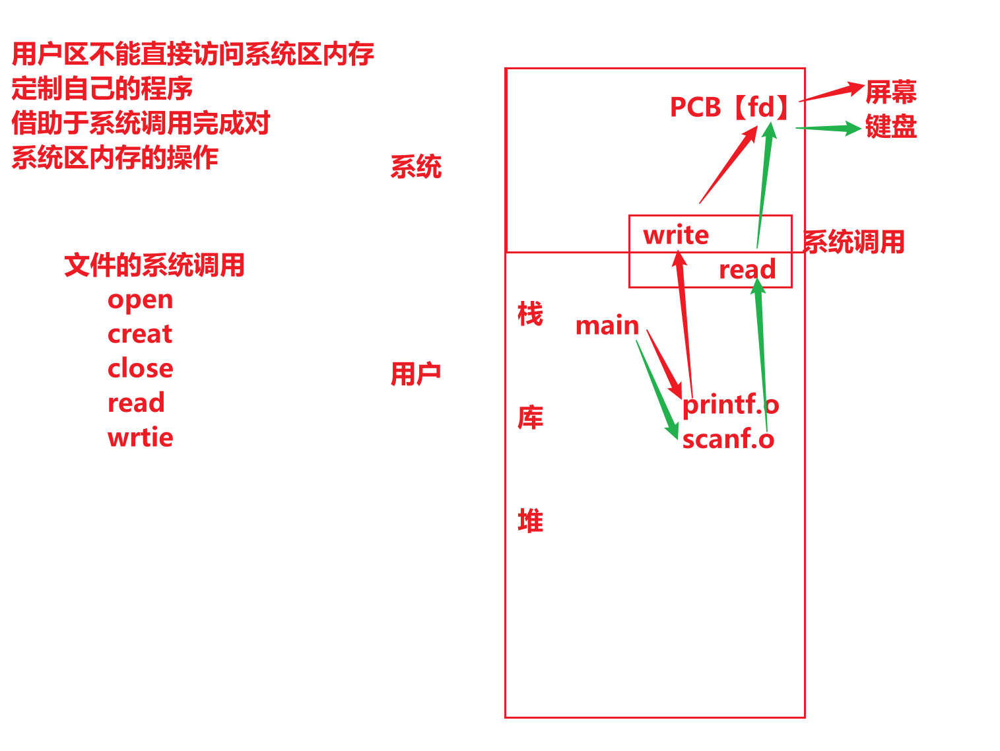

可以通过  man   查阅帮助信息

### 5.3	课堂案例

```c
//文件的基本操作，遵循   打开     操作    关闭 
#include <sys/types.h>
#include <sys/stat.h>
#include <fcntl.h>
#include <unistd.h>
#include <stdlib.h>
int main()
{
    //打开文件读取信息
    int  fd;//文件描述符
    fd = open("./my.txt",O_RDONLY);//返回-1代表打开文件失败
    char buf[512];//缓冲区
    ssize_t nread;
    if(fd == -1)
        return 126;//不推荐，可以使用 exit(126)  
    else{
        //对文件操作，   读取内容
        nread  = read(fd,buf,512);
        write(1,"read succ\n",10);
        if(nread == -1)
            exit(8);
    }
        
    //关闭文件
    close(fd);
    return 0;
}
```

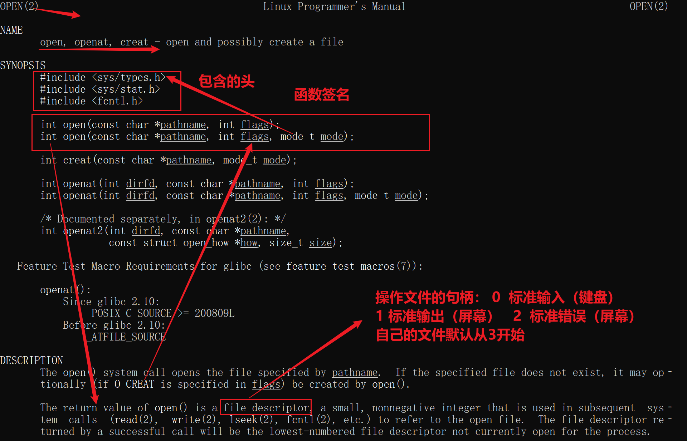

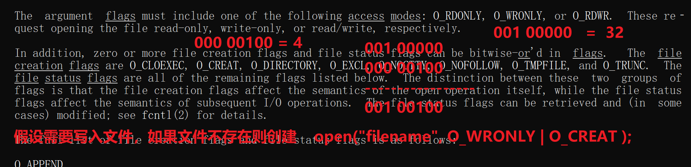

main函数返回一般都会返回给调用者【shell】，需要调用shell的环境变量   $?   ,      可以使用echo命令回显  


echo $?     


### 课堂练习：抽查

创建自己的程序   mycp, 使用方法    #  ./mycp     a.txt     b.txt     

作用： 将a.txt源文件拷贝为   b.txt的备份文件

命令行传参：   int main(int argc, char* argv[])  

 int dest = open(argv[2], O_WRONLY | O_CREAT , S_IRUSR|S_IWUSR|S_IRGRP|S_IROTH); 

int dest = open(argv[2], O_WRONLY | O_CREAT ,0644); 


### 5.4	文件属性的操作

常见的   lseek, perror,  Xstat,chmod,chown,Xlink

Xstat 【stat ， fstat，  lstat】  文件的状态信息

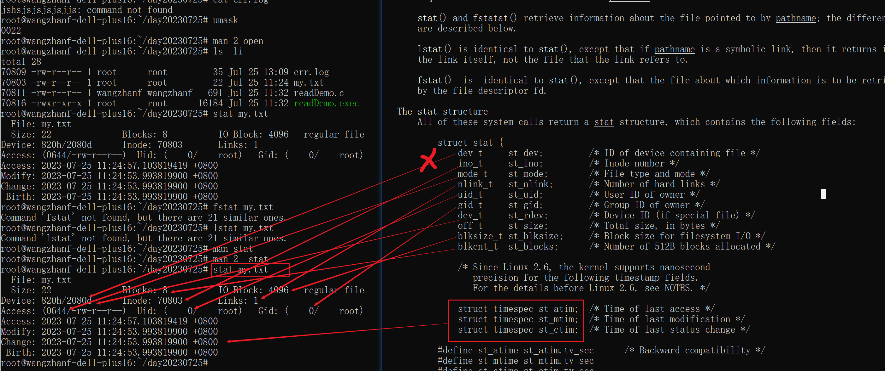

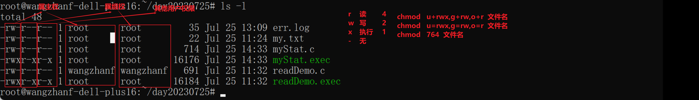


#### 课堂练习：截止  15：07【抽查】

仿照linux 的  stat命令，实现自己的文件状态信息展示工具，   需要展现的信息


# 6	信号

系统响应某些条件产生的一个事件（状态的改变），通过信号实现事件回调【处理】。

linux下可以通过   kill  -l   查看信号

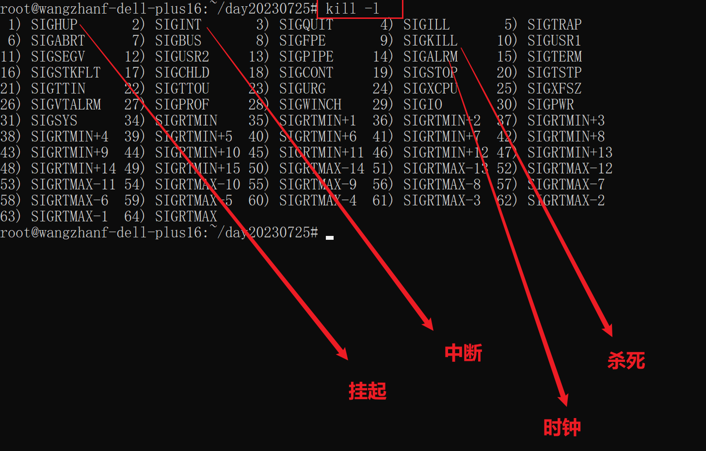

### 6.1	信号产生

来自于内核：  例如  段错误， 浮点数溢出  ，   内核会给进程发送一个信号

用户：Ctrl+C 产生   SIGINT  信号 

进程：一个进程可以通过    kill    的系统调用向另外一个进程发送信号   


### 6.2	信号相关的系统调用

kill	发信号

signal	指定对信号处理的回调函数

sigaction	指定处理方式

sigprocmask	修改信号挡板

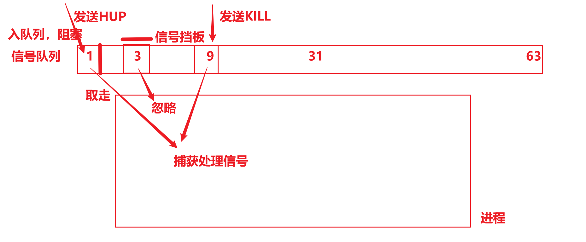

### 6.3	课堂案例


### 6.4	信号调用

pid	进程的唯一识别码，进程编号    通常可以通过   ps  -aux 获得

kill相关的系统调用中， pid > 0    (pid为42代表  42号进程)  ，  pid=0(同进程组的所有进程) ，   pid=-1（广播给系统内所有进程）

signal系统调用，将信号和处理函数关联起来， 第2个参数是  信号 发生时的   回调函数（函数的地址），对于信号的处理方式（默认，忽略，自定义处理），  SIGKILL，SIGSTOP不可以忽略，自定义的处理过程中可以通过   SIG_DFL  终止进程，  SIG_IGN  忽略信号


## 7	进程

进程就是程序的执行过程【动态】

进程是资源使用和分配的独立个体，进程使用独立的虚拟内存【每个进程都认为自己独占系统】

为了合理的管理多个进程，操作系统会在内核空间【系统区】存放进程的属性信息，PCB包括   PID，进程状态，已打开的FCB（fd）

假定：   vi   a.c    和   vi  b.c  

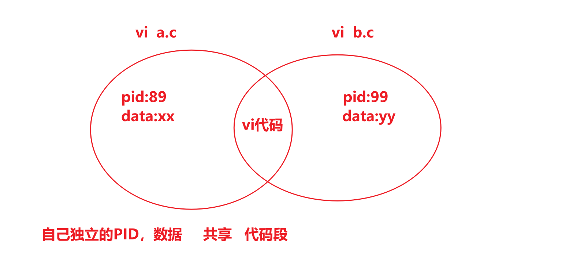

### 7.1	进程相关的系统调用

getpid()	获取进程pid

getppid()  获取父进程pid

通过命令行执行程序，  本质上   由shell（bash）   派生一个子进程，默认子进程会继承父进程的所有（除PCB的部分），意味着和父进程使用同样的内存空间（意味着 shell已经打开的文件描述符   0,1,2   子进程默认也继承了）

fork()  派生子进程 ， ............  ，将控制返回给两个进程  ，   fork如果成功，则会在父进程返回子进程的pid ，在子进程返回 0；

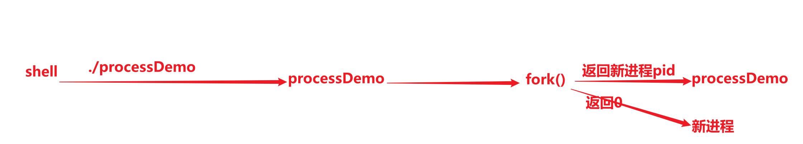

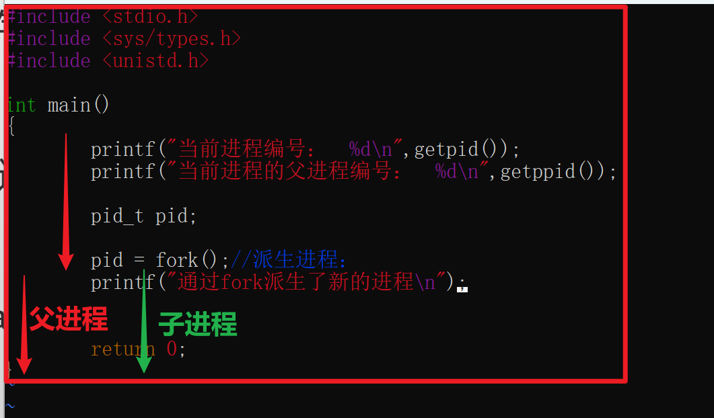


### 7.2	课堂练习：随机抽查3人  【截止11：35】陈冠，何金蓉，山睿

通过fork派生一个子进程， 父进程打印5次进程编号信息，子进程打印3次进程编号信息，   每次打印休眠1秒【选做   ctrl+C   输出中端信息 】


### 7.3	控制进程的执行过程

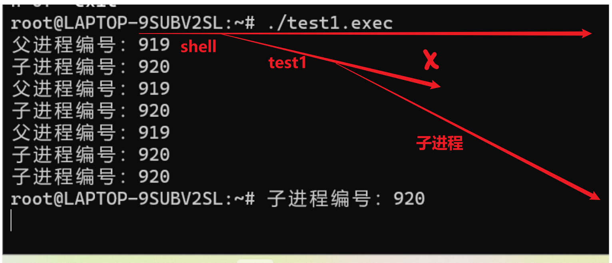

可以通过系统调用   wait() ，waitpid() 让父进程在子进程结束后再结束，   wait工作机制派生子进程后使用wait阻塞父进程，子进程结束后解除父进程的阻塞状态【可以接收子进程返回的值】

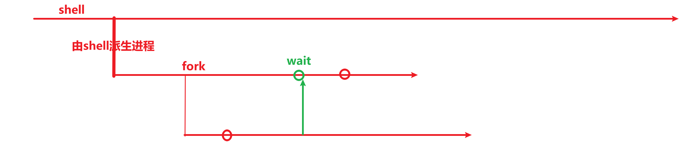

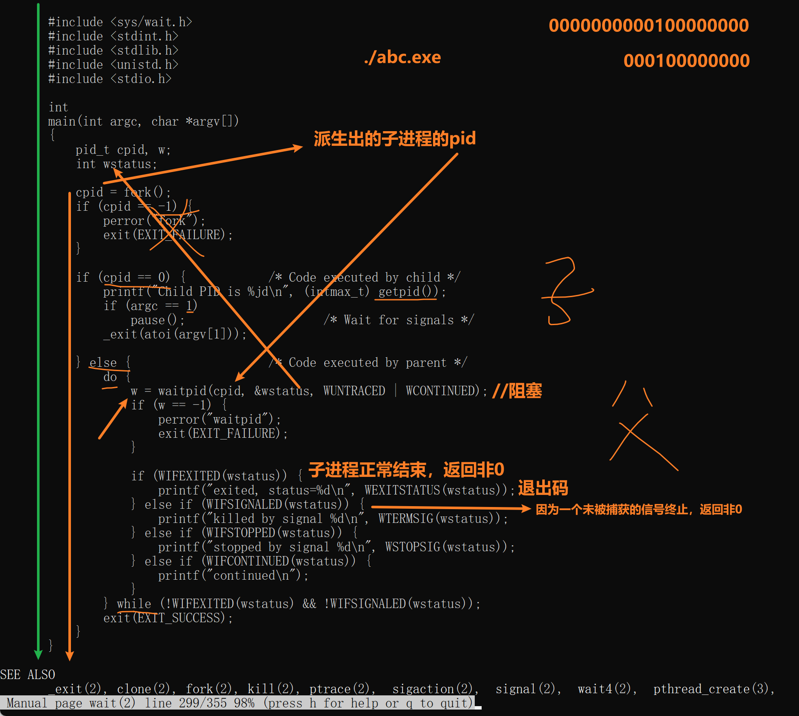


### 7.4	exec系统调用

exec根据参数指定的进程名替换当前进程【挖空当前进程空间用指定的进程替代】

exec是一个家族：man   3   execXXXX    


# 课堂练习：随机抽查【14：30】

一个应用程序， 初始界面  展示菜单    (1	使用自己编写的myStat查看文件状态      2     使用系统stat命令查看文件状态       0    退出)

1和 2 的功能均使用子进程完成，子进程执行结束父进程打印一条消息。

假定应用程名称为     app     ， 执行过程         ./app    文件名

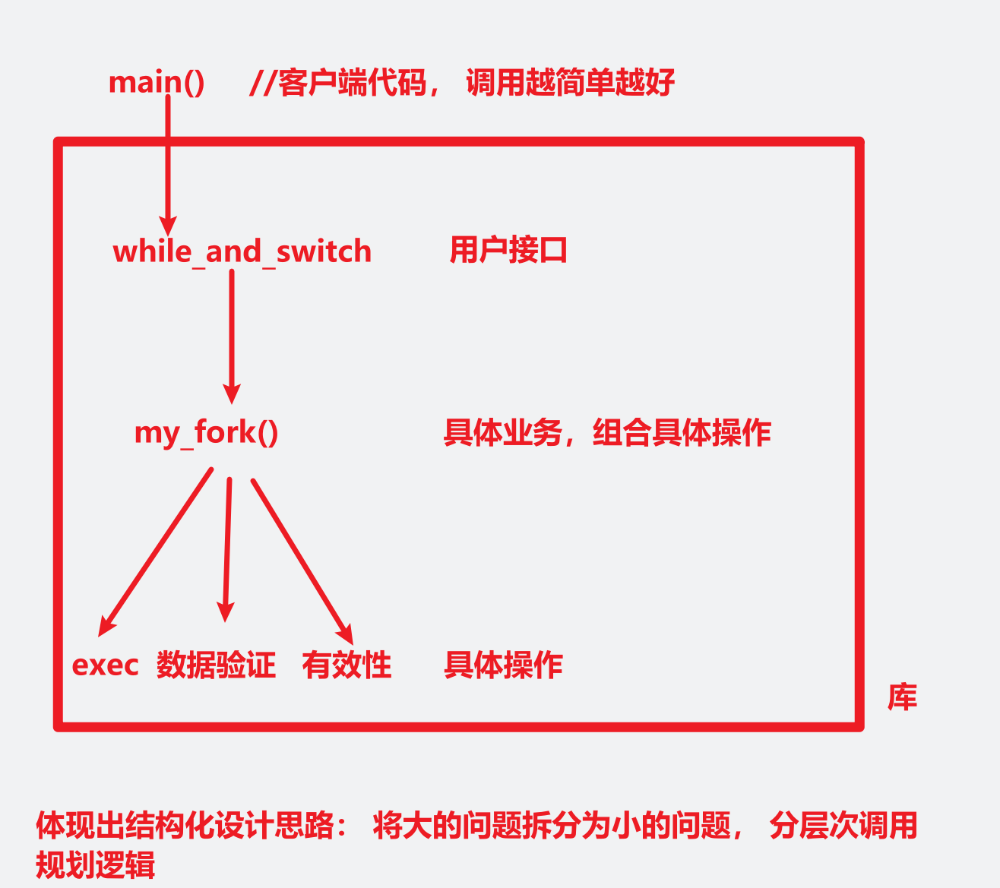


进程之间也存在通信的需求

最简单的方式：    进程管道  popen【pipe open】， 


# 网络编程

## 1	网络编程

实现多机之间的通信，本质上还是对文件的操作

通常网络编程基于socket实现，套接字编程

通信双方遵守统一的规则【协议--数据格式】，能够通过地址识别通信方【ip和端口】

通信双方只需要同层协议相同【网络为了便于管理使用分层架构， 下层为上层提供服务，上层通过下层提供的SAP 使用服务】

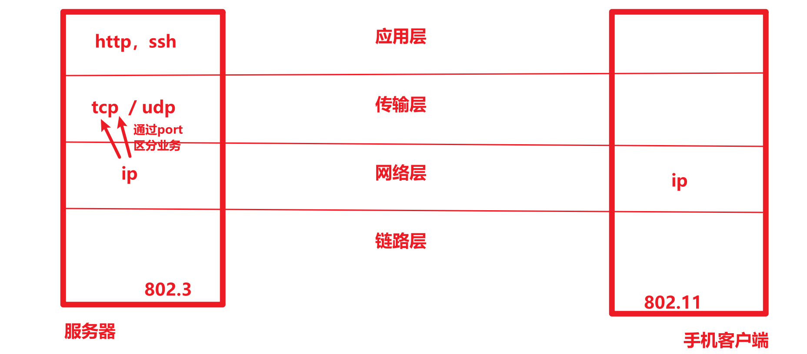


# 2	linux下socket编程实现

### 2.1	编程步骤

a	创建套接字--socket()   

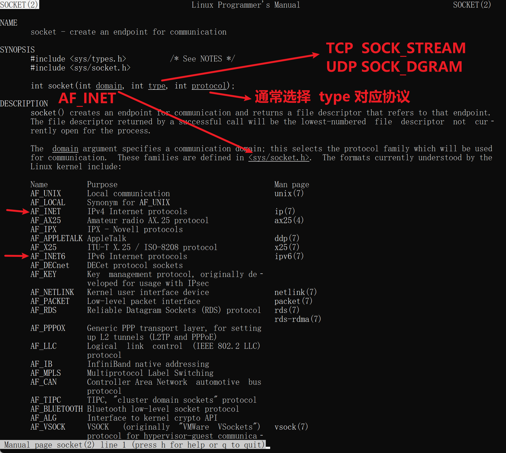

b	为套接字添加识别信息（ip地址和端口号）--bind()

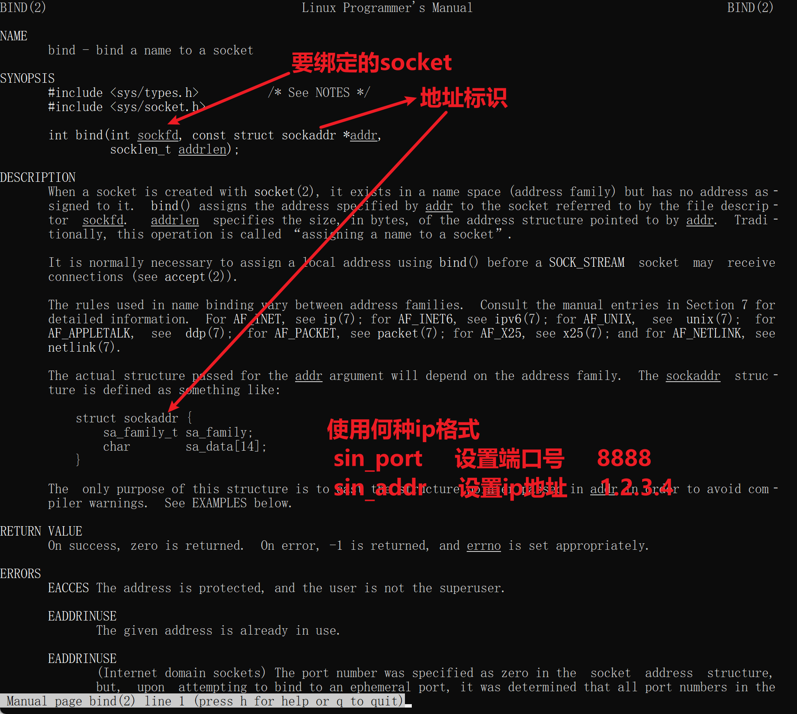

c	监听网络连接--listen()

d	监听用户接入请求，接受连接--accept()

e	数据交互

f	关闭资源【套接字】，断开连接


# 附录

## 1	linux的常用命令

ls  ：	列出目录列表

cd 目录名：   	切换目录，进入目录

mkdir  目录名  ：  创建目录

vi   -O   文件名1  文件名2 .....   ：  同时编辑多个文件，  一般模式下  按  ctrl+w  多窗口切换

cp    源文件     目标位置    ：  拷贝文件

rm  文件名：   删除文件

pwd  :    显示当前所在目录

chmod :   修改文件权限      ，     chmod    777   .    修改当前目录对所有用户可读可写可执行

stat  文件名：   查看文件的状态（属性）信息

ps  -aux  ：   获取进程列表

pstree：    查看进程树结构

kill  -信号    pid   :   给进程发送信号

## 2	man手册的使用

man  man   ：  查阅man的使用

man   章节号   关键字  ：  查阅对应章节中的信息

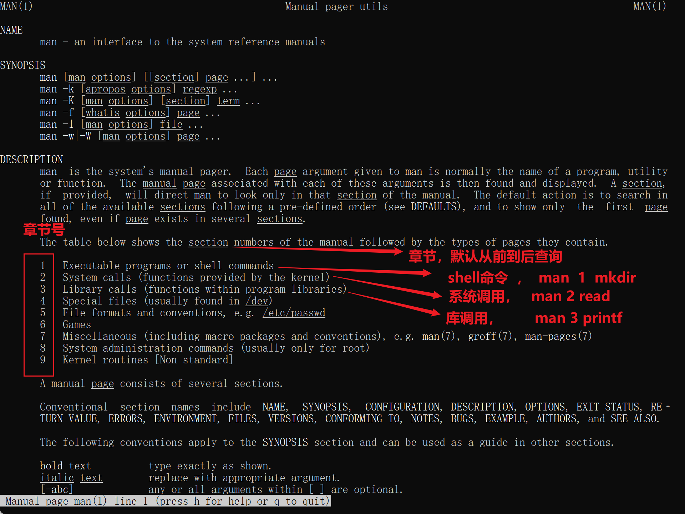

q	退出

？关键字     或者  /关键字      ：向前和向后查找    ，   n和N   查找前一个或后一个

g  或  G  跳转到行。 


20230725下午14：14  签到


王泽萱，苏瑞嘉，李明泽（已回复）


20230726上午签到【未签】


# 面向对象和C++

面向对象自下而上的抽象过程，  类似于人类思维思考问题的过程。

表象： 面向过程  【 run(toy) 】,面向对象  【toy.run()】

落地： C++  实现【面向过程，面向对象，面向方面，泛化编程】


利用C实现程序需求：描述一个人【姓名，年龄】，展示基本信息，增加人员信息【通过面向对象思维解决】

```c
//面向过程的伪码实现

struct Person{
    char name[20] = {'0'};
    int age = 18;
};
void show(struct p)
{
    printf("===============================");
    printf(p.name,p.age);
    printf("===============================");
}
int main()
{
    struct Person p;
    show(p);
    scanf("%s",name);
    scanf("%d",&age);
}
```

```c
//面向对象的实现

#include <stdio.h>
#include <string.h>


//独立的声明文件     Person.h
#define MAXNAMELEN 20
typedef struct _Person{
	char name[MAXNAMELEN];
	int age;
	void (*printMe)(void);
	void (*add)(void);
}Person;


//初始化函数，形成正确的调用关系
void initPerson();

void PrintMe(void);
void Add(void);

//声明一个当前对象
Person person;

//独立的定义文件    Person.c

void PrintMe(void)
{
	printf("%s,%d\n",person.name,person.age);
	return;
}

void Add(void)
{
	char tempName[MAXNAMELEN] = {'0'};
	int tempAge = 1;
	printf("Please input name(1-19 character):");
	gets(tempName);
	printf("Please input age(1-99 Integer):");
	scanf("%d",&tempAge);
	strcpy(person.name,tempName);
	person.age = tempAge;
	return;
}

void initPerson()
{
	person.printMe = PrintMe;
	person.add = Add;
}

//独立的客户端代码文件    main.c
int main()
{
	initPerson();
	
	person.add();
	person.printMe();
	return 0;
}
```


## 1	面向对象的特征

### 1.1	抽象【组织】， 利用各种对象【东西】组织一个更大的对象【东西】

### 1.2	封装【隐藏】，实现数据的安全访问，符合蛋图

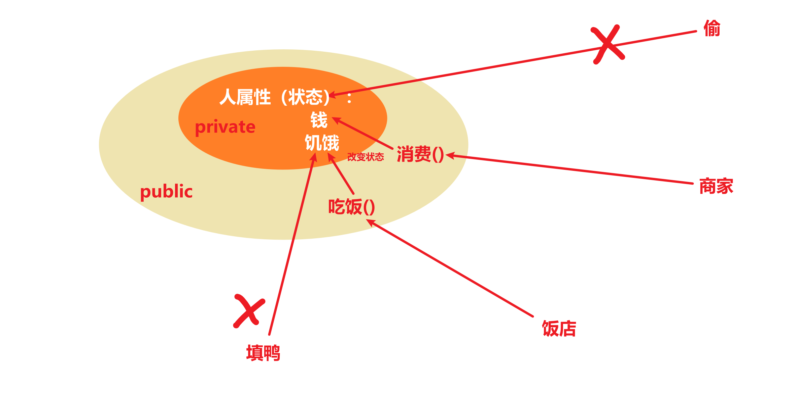

课堂练习，随机抽查【11：00】：  创建一个学生类，含有属性【年龄--私有，分数--公共】，建议通过构造函数实现对象的基本构造，通过方法改变属性值，通过方法展现学生信息  。

### 1.3	继承【复用】，派生对象包含了父对象的所有

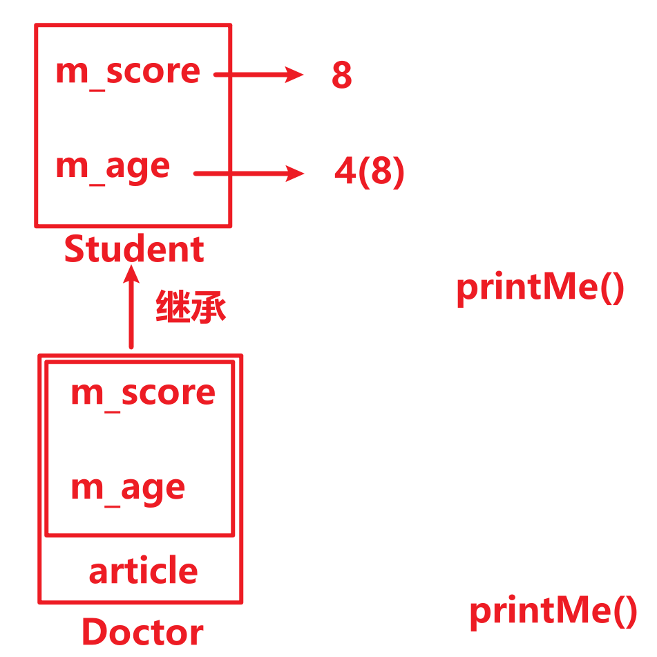


课堂练习：   验证继承关系

### 1.4	多态【泛化】： 对同种消息的不同处理

表象：   运算符重载，覆写override，函数重载overload    


# Qt

## 1	Qt基础

双重授权模式【个人免费， 企业付费】

跨平台 C++  图形框架【侵入式】

Qt采用可插拔模块方式

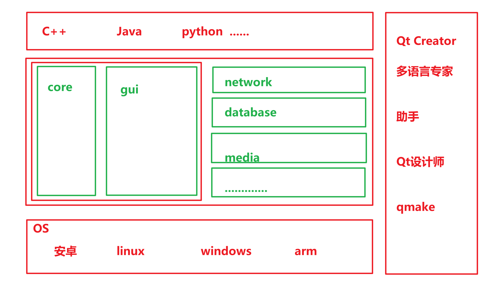

安装注意： 安装的路径和项目的路径不建议放置在中文或者特殊字符目录  。

## 2	构造第一个项目

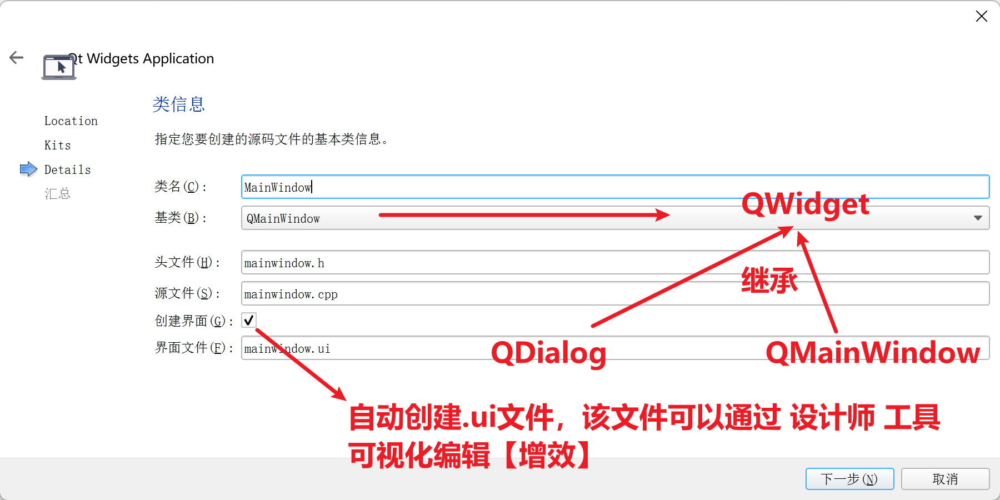

ui文件通过设计师工具进行编辑

如果通过设计师修改了ui文件，  先运行（调用moc进行编译）  ，   在代码中才可以识别组件对象。


课堂练习（随机抽查）：   创建Qt的项目并运行，提交运行截图【14：27】


## 3	Qt项目的基本结构

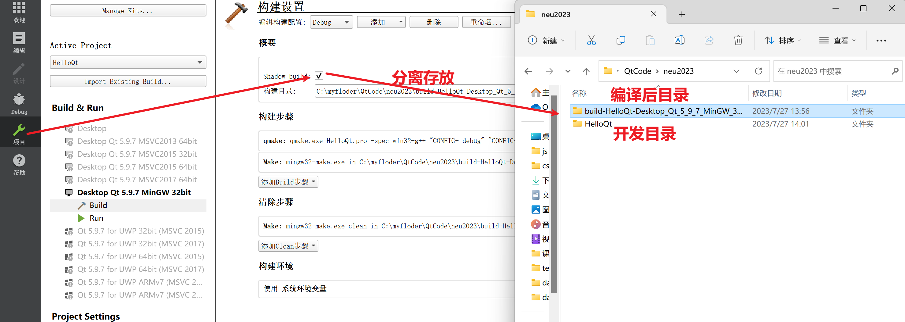


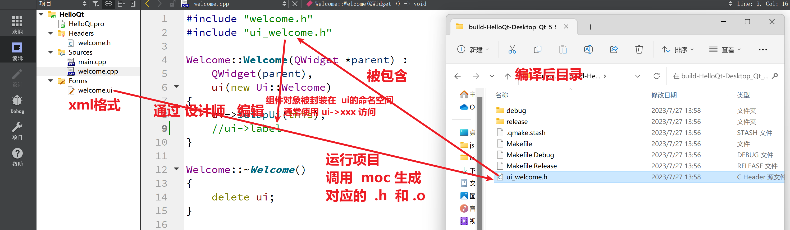


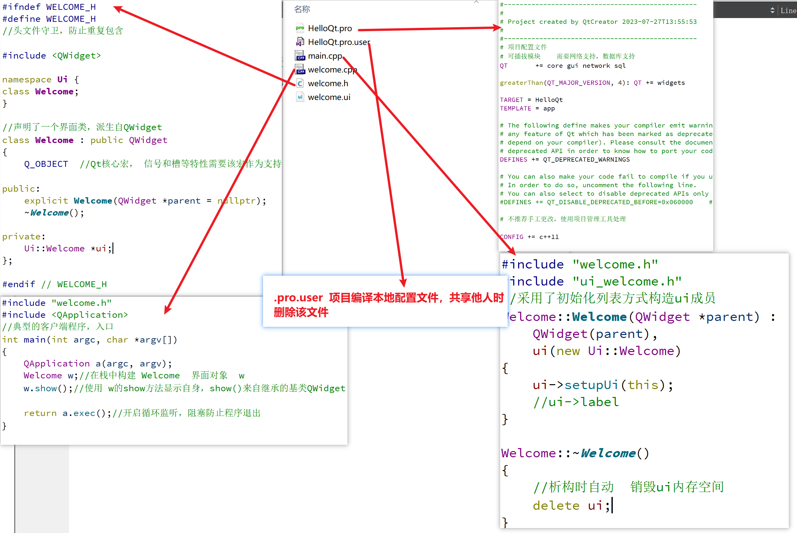


## 4	Qt窗口部件

QWidget 类是所有界面类的基类

窗口部件可以作为顶级窗口（没有父窗口）存在，也可以作为子部件（实现自动内存回收）存在

窗口部件的默认空间是矩形空间，可以通过相关属性进行设置和获取，Qt的规范中， 假设存在abc属性，一般会存在同名方法   abc（）作为getter ， 一般会存在 setAbc(...)  作为  setter。

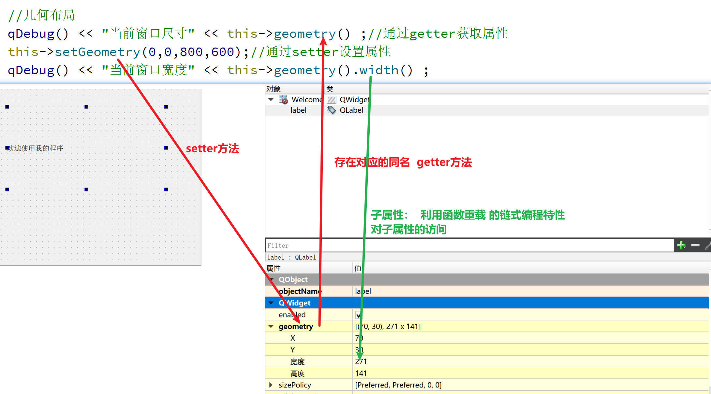

课堂练习：随机抽查

​	代码实现：   


## 5	窗口类型

可以利用 日志输出 或者断点调试   调试程序

创建对象考虑   创建在栈还是堆

弹出窗口  可以使用  模态  或者   非模态  确定是否阻塞程序

课堂案例：截止   9：50

​	打开程序，弹出续费窗口并且阻塞程序运行，弹出的窗口中显示续费字样。


## 6	标准对话框

通用的功能，Qt已经封装完毕，直接调用即可  【打开文件， 调整字体....】

标准对话框通常只需要一个实例 【打开文件对话框只能出现1次】，  Qt利用   单例模式  对部分对话框进行了封装， 通常会提供静态方法【类方法】获取该实例

对于对话框的使用，参考Qt助手完成 


课堂案例（随机抽查）：课间休息+作业练习  ，截止  11：20

​	程序运行时，弹出打开文件对话框（QFileDialog）， 选择打开  “txt”文件，如果能够打开对应文件将文件内容（QFile）展示在显示区（QLabel）  ，  如果未打开文件则弹出警告对话框（QMessageBox）。


## 7	信号和槽

Qt出于   对象通信考虑   提出的编程模式

类似于   设计模式中的   观察者模式，  主题发布者发布信号  ，  观察者收到信号采取措施。

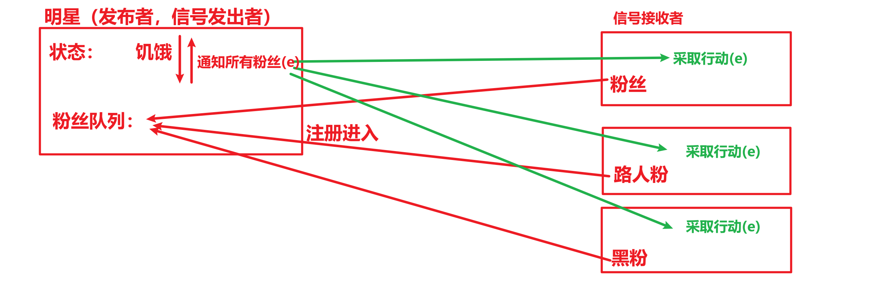

信号的参数和槽的参数是匹配的，信号的参数可以多于或等于  槽参数不能少于

信号和槽 本质上都是函数

信号只有函数声明没有定义部分【没有函数体】，一般定义在signals宏段中 ，没有返回值

槽 需要既有声明也需要有定义【必须有函数体】，     一般定义在slots宏段中，不建议有返回值

### 7.1	信号和槽的实现

a	在ui界面组件  “转到槽”   ，  自动生成   on _ 对象名 _ 信号类型（）槽函数 

b	使用connect的Qt4宏方式关联（注册）信号和槽的关系   connet(信号发送者，SIGNAL(发送的信号)，信号接收者， SLOT(接收后处理的槽函数))【不推荐  ，没有错误检查， 运行时才有提示】

c	使用connect的Qt5关联（注册）信号和槽的关系   connet(信号发送者，发送的信，信号接收者， 接收后处理的槽函数)     【推荐的形式，在前期即可检错】

d	使用connect的Qt5关联（注册）信号和槽的关系，如果存在（信号，槽）函数重载，需要显式声明函数指针解决歧义问题。

e	使用lambda表达式（函数式编程），简化编程逻辑【语法糖】


### 7.2	在现有项目添加组件【界面类，资源，普通C++类】

界面类【.h  声明， .cpp定义   ,  .ui可视化界面】  ，   也可以封装自己的组件 。  通过 在设计师 添加   Widget组件然后提升自创建组件完成 ，   代码级别引入和普通组件没有差异

资源【.rcs】:  推荐项目中使用的  文本，图片，媒体采用资源方式管理（不推荐使用绝对路径），  【过程，1  拷贝文件到项目目录， 2    添加资源文件  .qrc      ，3   添加前缀 和   文件  】


## 8	界面布局

布局方式通常有   ：

a	硬编码模式【不能自适应】

b	基于事件的自适应

c	使用布局管理器

## 9	事件

状态的改变，可以【忽略，默认处理，自定义处理】处理措施的异步编程模式

Qt中事件编程的基本思路，   覆写父类提供的事件处理虚函数   ，强化功能，能够形成多态调用

事件发生时，覆写的事件处理函数会接收     QEvent  对象作为参数，  事件的细节被封装到  QEvent 。


## 10	界面装饰

推荐使用独立的qss   样式表【Css类似】文件    进行修饰

qss和css   采用选择器匹配生效原则，   选择器匹配到的元素则会层叠受到 样式属性的影响

常见的选择器有：

序号	名称					定义方式									匹配原则

1	id选择器				#对象名										对象名和选择器明完全相同的

2	class选择器		   .类名											 所有该类的成员

2	通用选择器		    *												    匹配所有成员


20230728课后作业：

编写一个点菜程序，组件化封装方式

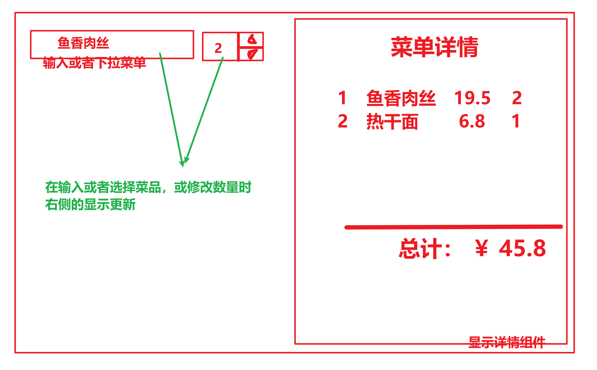


课堂练习【随机抽查】13：55：   组装自己的组件， 在主界面引入自己的组件，   组件内部子部件之间采用信号和槽进行通信。


# 


叶星宇  有回应


 蔺吉庆(蔺吉庆)@15:11    有响应