课程：

技术【C，面向结构，C++，面向对象，Qt】

辅助：

项目：


# 项目启动会

介绍项目

概要描述

运作方式

考核方式


## 1	什么是项目

a	上课学习内容		【不是】

b	活动答辩				【是】

我打算购买一辆新能源汽车跑滴滴。【前序阶段是**项目**， 后序阶段是**运营**（重复为了持续）】

项目是为了得到某种产品、成果、服务 而付出的临时的一次性努力

### 1.1	项目的特点：

​	a	临时性，有开始时间和结束时间，  项目是追求结束的

​	b	独特性，没有完全相同的两个项目，意味着其他项目的资料只能借鉴，不能直接复用。

​	c	渐进明细性：随着项目推进细节部分更加细化，符合波动式计划原则


## 2	如何做好项目管理

a	熟悉项目管理的相关知识【图示技术，分析技术】

b	良好的沟通和协调能力【主动，扫清沟通障碍（语义、认知）】

c	应用领域的知识、标准和规定【不同的项目深入了解其背景】

d	按照管理流程实施【项目管理的各个环节都是可以概略的或者可裁剪的，Plan Do CheckAction】


本项目着重体现四个方面：   需求，设计，编码规范，测试

## 3	项目概述

完成       智能家居系统 的2个子部分【服务器+控制中心】

服务器：  linux下c实现（不限定必须是socket）

控制中心：Qt结合C++实现（通用智能家居控制中心基本功能，包括但不限定于   灯光，温度，窗帘，监控）

# 

## 4	运作方式

PDCA推进流程，

尽量能够提前实现【设计和编码】


## 5	考核方式

过程（需求15%+设计30%+代码30%+测试25%）   ，   答辩（演示，答辩）


# 需求

重要程度： 由需求抽象出范围（范围说明书，WBS，WBS字典）， 指导项目后续开发的基础

需求划分：按阶段划分为

​	a	用户高层需求：一个idea，一个描述，一个期望，通常表现在【招投标文件】

​	b	产品需求：功能，架构  ，  通常表现在 【SOW】

​	c	开发需求：功能细节，非功能，设计约束，通常表现【需求规格说明书】


## 需求的描述

### 1	尽量使用自然语言描述，减少歧义的产生

使用该系统必须先登录，打开软件时，首先进入登录页面，自动将输入光标聚焦在用户名输入框，输入正确的用户名以及对应的密码，点击登录按钮进入系统，用户名和密码不对应则显示出错提示信息。

### 2	适当时可以采用数学方法描述或者  正则表达式的方式描述

用户名的格式需要符合规范

​	数学描述：（6，8】   

​	数据字典： 1-9 + a-z + ！- ^       或    {(1-9)}7

​	正则表达式：  "^[0-9a-zA-Z!-^]{6,8}$"   

### 3	描述时可以采用模板方式

结合  《需求跟踪矩阵》   描述需求， 当前需要完成任务， 结合  《项目文档》说明，  课堂笔记  ， 编写  《需求跟踪矩阵》  ，     在评审截止前提交【8月1日的 11点之前】， 命名规范        姓名 _ 项目名称 _ 需求跟踪矩阵(RTM).xlsx 


# 学员任务：   【1V1指导方式】

可以文字提问或者   语音连线

如果没有提问者， 对历史文件进行评审，需要点名同学连麦  


# 当前： 需求分析文档制作


# 


# 文档与配置管理

需求--》范围--》.........配置

产品配置是指一个产品在其生命周期各个阶段所产生的各种形式的和各种版本的文档、计算机程序、部件、数据。

对于产品配置：权限管控，日志记录，保留所有的历史版本。

配置管理的参与人员：PM项目经理根据CCB批准的配置管理进行管控，CMO配置管理员负责执行和向CCB报告，DEV开发人员参与过程，SIO系统集成员负责发布版本。

配置项：描述一个事物的属性（名称、标识符、文件状态、版本、作者、日期）

配置库： 一组受控制的、辅助软件开发、使用和维护的软件相关说明

​	1	开发库（动态库）：开发人员个人专用,进行控制内容（没有权限控制）

​	2	受控库（主库）：某个阶段的产物（有权限控制），DEV只读，CMO读写。

​	3	产品库：完成测试后的最终产品。

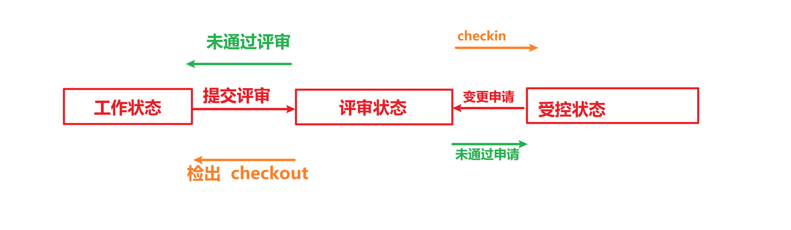

可以使用版本号进行区分：

内部版本和外部版本：内部版本一般称为构造基线，例如NT6.1   ，外部版本一般称为发行基线，例如windows7

通用版本规则X.Y.Z:

​	X	主版本	架构

​	Y	次版本	功能

​	Z	修改状态	有Z代表不稳定

1.0	通常代表第一个正式发布的版本，    0.8	通常代表 草稿   


借助配置管理工具实现自动管理

# git	

开源，分布式配置管理工具

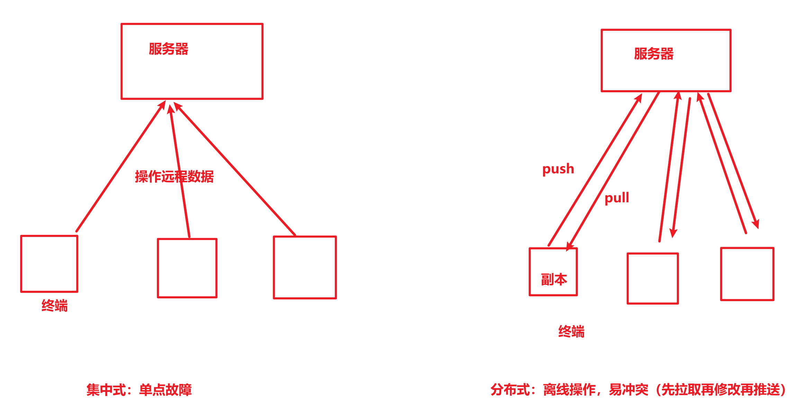


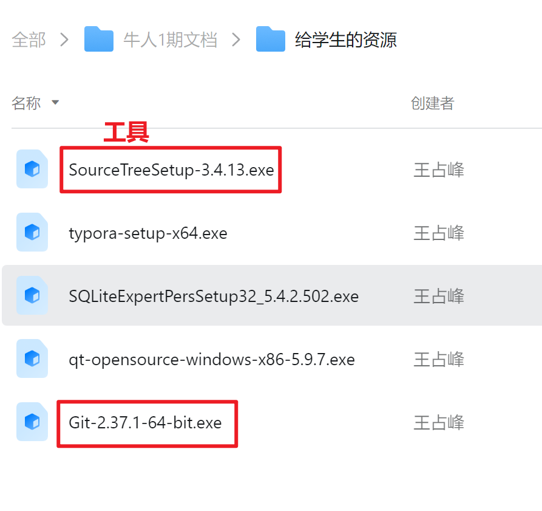

## 如何使用git

在 工作区  右键鼠标   选择   “git  bash  here”   即可

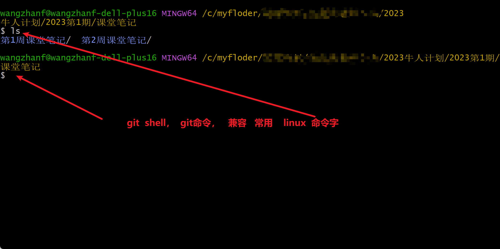

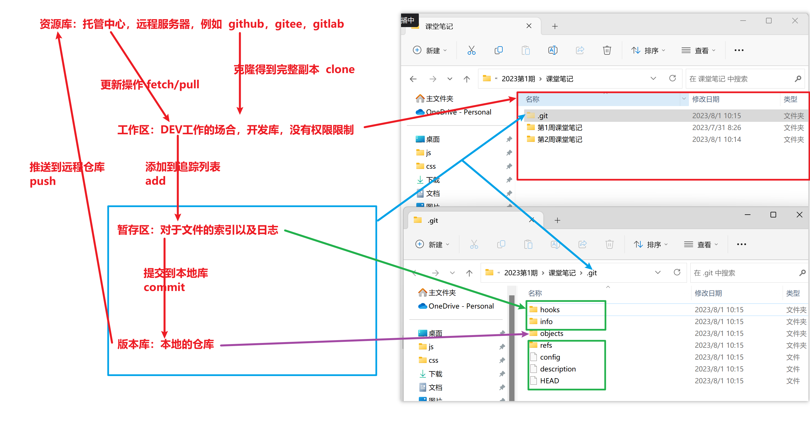

如何推送到远程仓库：

1	选择远程仓库并且注册账号

2	本地生成ssh密钥对， 设置远程仓库的密钥

3	创建远程仓库

```
第一次使用远程仓库内容，   git  clone   仓库地址即可
```


课堂练习： 11：22     ,  拉取课堂笔记到本地，截图提交


# 需求评审

成果物   CA的过程，  Check    ，通用的问题提出后参照自己的文档 进行    action

齐备性，质量。


1	模板中  【黄色和蓝色提示信息都需要按实际情况填写】

2	生效日期通过第一次评审后的日期

3	执行者，编制者   和   审核者    不能是同一人

4	变更： 通过评审后修改必须填写变更履历

5	需求点的划分粒度足够【按功能点划分】

6	需求一定是无歧义的


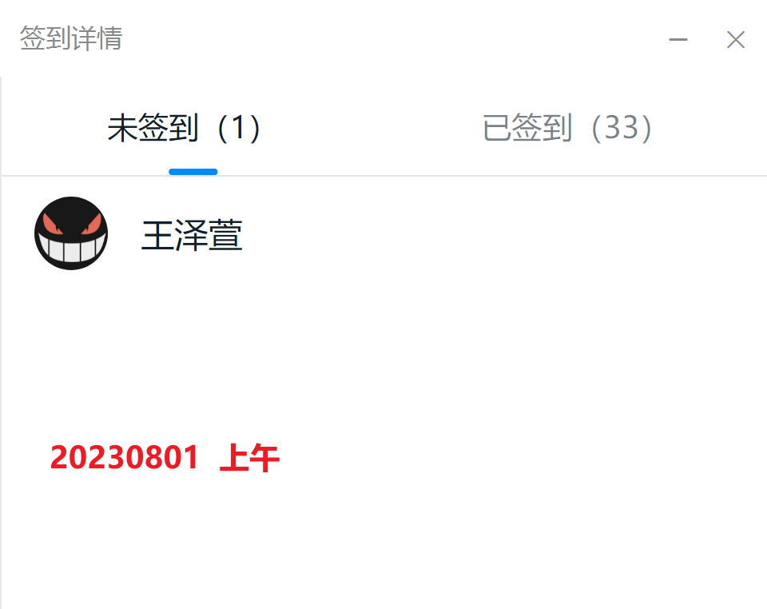

# 详细设计

逻辑上表示，构建关系，建立模型

通常按照项目的推进顺序【瀑布模型】 ，将设计分为     概要设计【模块之间关系】    ，   详细设计【模块内部】

遵守    低耦合，高内聚  

设计就是对系统的不同角度的看法描述，角度越充分看到的越全面

通过图形化相关技术从不同的视角描述系统，需要认知到没有一个模型可以完备的表示系统，需要在多个视角建模系统设计更加晚上。

## 1	常见视角

1.1	外部视角：对系统的上下文或环境进行建模

1.2	交互视角：对系统和外部环境，系统内部构件之间的交互  进行建模

1.3	结构化视角：对系统的组织或者处理的数据结构进行建模

1.4	行为视角：系统的动态行为如何响应事件


可以采用任何的图示，描述  【便于沟通和理解】

推荐使用   UML 统一建模语言表示    

推荐使用	https://www.processon.com/  


## 外部视角：

上下文模型： 确定系统的边界

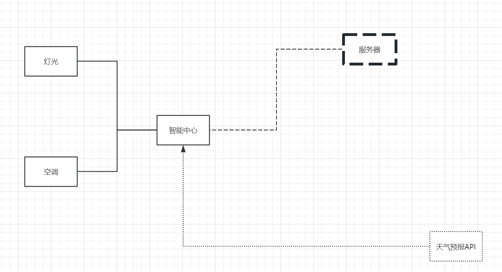

架构模型：项目的主要实现中体系结构描述（分层，C/S，过滤器，知识库）

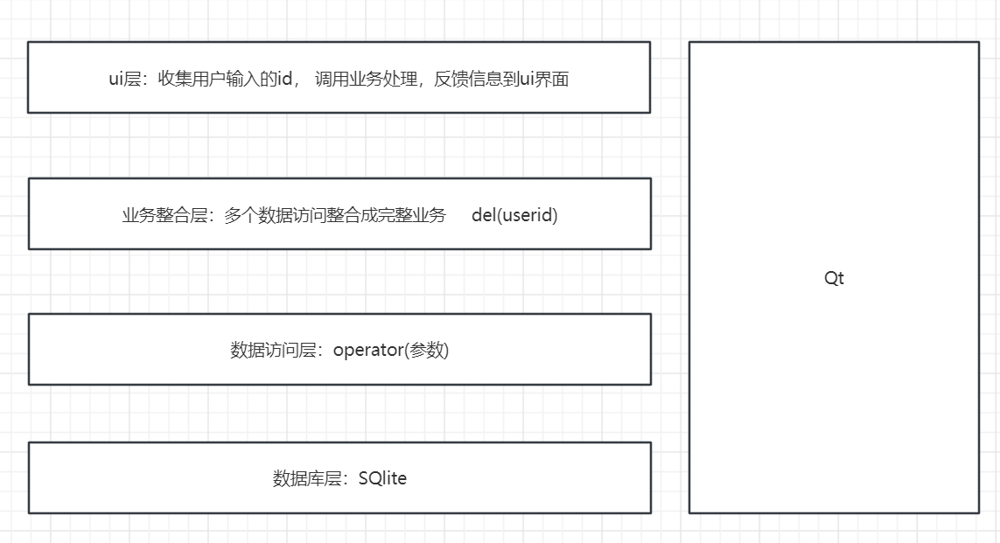

活动图：

uml中   活动图、泳道图  都可以表示事务推进的过程


## 交互视角

用例建模：  和系统之间的交互

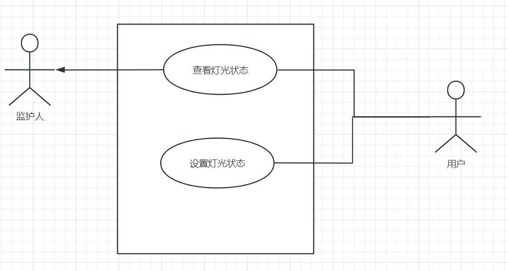

顺序图建模：

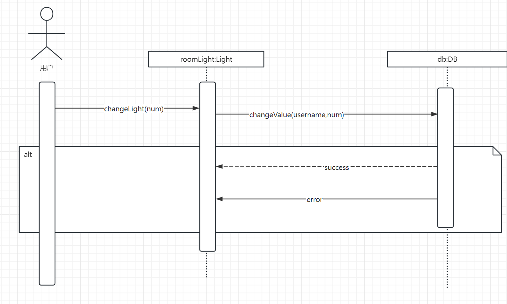

## 结构视角

最常用的方式： 类图【继承，实现，组合，聚集，关联，依赖】

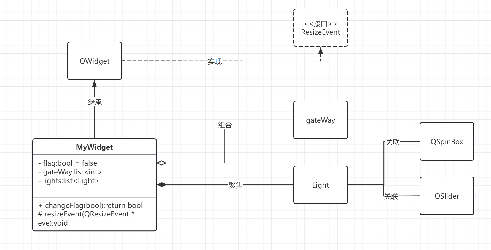


## 行为视角

基于状态改变的事件驱动，使用状态图描述


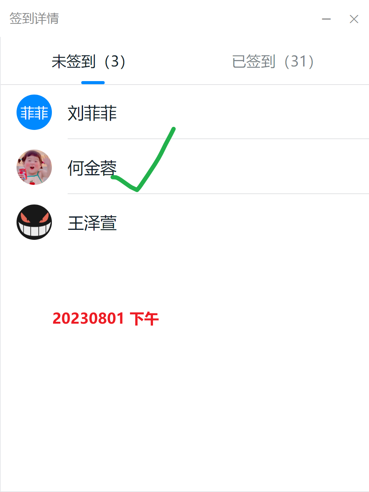


设计：逻辑思维表现，掌握规则，利用规则

设计是视角问题：没有完备视角


# AI辅助编程

代码补全：	根据啥下文自动完成代码，提效和准确性。 通常由  IDE完成  。 例如    Copilot（CodeGeex）  ，aixcoder

```c++
document.querySelectorAll("body")[0].onclick = function(eve){
   //弹窗 
}
```

代码检查： 根据编码标准和规范以及最佳实践，分析代码，提供质量/规范/安全的建议。 例如   DeepCode   ，chatgpt

​				代码存在哪些问题，可以优化哪些部分，优化后结果  

代码优化：

代码重构：

代码解释/翻译：更偏向于  高级语言（接近自然语言4GL--SQL）

代码测试：  发现潜在的缺陷和漏洞（和需求不一致的部分），TestNG，  偏向于web测试   Selenium  （持续集成测试工具）


文档编写处理：  NaturalDocs，   javadoc，  swagger 

# 

AI辅助编程：   指导方针   ， 使用    ，   符合   方法论


# 


# 当前教师任务：   【1V1指导】

可以文字提问或者   语音连线

如果没有提问者， 对历史文件进行评审，需要点名同学连麦  


# 当前学员任务： 设计文档制作


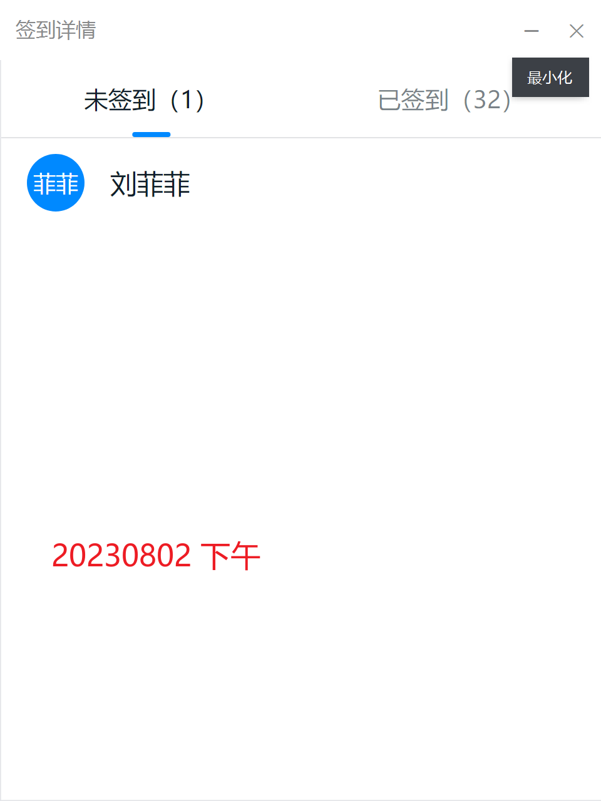


# 服务器的实现

在后台监听（后台任务）在系统的某个端口，等待客户端连接收发信息。

相关命令：         

ps   aux    查看进程     

netstat -an      查看网络连接状态   

ifconfig /ipconfig   查看网络配置参数

ping   对端ip     测试网络的双向连通性   

考虑服务器的层次：

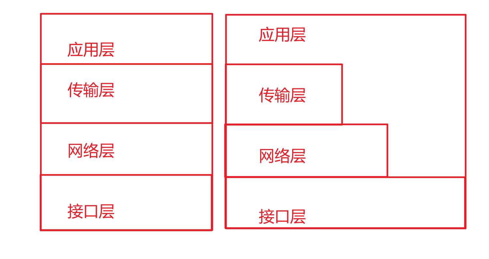

客户端如果迁移到windows：   重新实现windows下tcp编程，或者使用通用客户端telent,  还需要考虑用户的易用性问题。

越偏向高层，易用性越好。

推荐的方式：    服务器采用通用的服务器方式【HTTP】，客户端可以是任意浏览器或者Qt的http包，传输标准的JSON格式数据。


HTTP

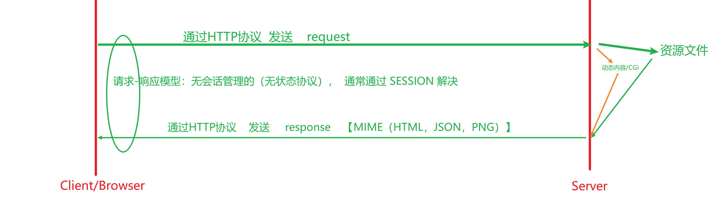


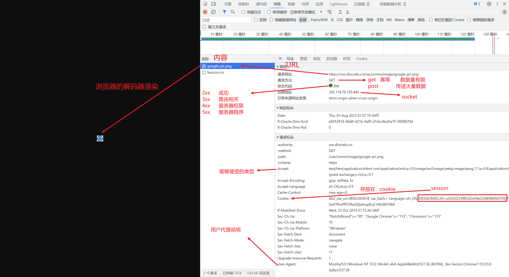

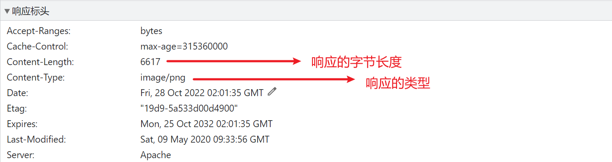


URL  ：  统一资源定位符

​	静态资源：      http://1.2.3.4/image/a.png        [只需要考虑  绝对路径和相对路径  ]

​	动态资源：      通常  CGI标准实现   ，      GET     http://1.2.3.4/cgi-bin/myStat.exec?arg1=val1&arg2=val2.....    ,  CGI提供了方法和属性 方便对  请求的操作  。getenv()可以获取HTTP   的相关包信息

```c
/* $begin tinymain */
/*
 * tiny.c - A simple, iterative HTTP/1.0 Web server that uses the 
 *     GET method to serve static and dynamic content.
 *
 * Updated 11/2019 droh 
 *   - Fixed sprintf() aliasing issue in serve_static(), and clienterror().
 */
#include "csapp.h"

void doit(int fd);
void read_requesthdrs(rio_t *rp);
int parse_uri(char *uri, char *filename, char *cgiargs);
void serve_static(int fd, char *filename, int filesize);
void get_filetype(char *filename, char *filetype);
void serve_dynamic(int fd, char *filename, char *cgiargs);
void clienterror(int fd, char *cause, char *errnum, 
		 char *shortmsg, char *longmsg);

int main(int argc, char **argv) 
{
    int listenfd, connfd;
    char hostname[MAXLINE], port[MAXLINE];
    socklen_t clientlen;
    struct sockaddr_storage clientaddr;

    /* Check command line args */
    if (argc != 2) {//  ./tiny  9999
	fprintf(stderr, "usage: %s <port>\n", argv[0]);
	exit(1);
    }

    listenfd = Open_listenfd(argv[1]);
    while (1) {
	clientlen = sizeof(clientaddr);
	connfd = Accept(listenfd, (SA *)&clientaddr, &clientlen); //line:netp:tiny:accept
        Getnameinfo((SA *) &clientaddr, clientlen, hostname, MAXLINE, 
                    port, MAXLINE, 0);
        printf("Accepted connection from (%s, %s)\n", hostname, port);
	doit(connfd);                                             //line:netp:tiny:doit
	Close(connfd);                                            //line:netp:tiny:close
    }
}
/* $end tinymain */

/*
 * doit - handle one HTTP request/response transaction
 */
/* $begin doit */
void doit(int fd) 
{
    int is_static;
    struct stat sbuf;
    char buf[MAXLINE], method[MAXLINE], uri[MAXLINE], version[MAXLINE];
    char filename[MAXLINE], cgiargs[MAXLINE];
    rio_t rio;

    /* Read request line and headers */
    Rio_readinitb(&rio, fd);
    if (!Rio_readlineb(&rio, buf, MAXLINE))  //line:netp:doit:readrequest
        return;
    printf("%s", buf);
    sscanf(buf, "%s %s %s", method, uri, version);       //line:netp:doit:parserequest
    if (strcasecmp(method, "GET")) {                     //line:netp:doit:beginrequesterr
        clienterror(fd, method, "501", "Not Implemented",
                    "Tiny does not implement this method");
        return;
    }                                                    //line:netp:doit:endrequesterr
    read_requesthdrs(&rio);                              //line:netp:doit:readrequesthdrs

    /* Parse URI from GET request */
    is_static = parse_uri(uri, filename, cgiargs);       //line:netp:doit:staticcheck
    if (stat(filename, &sbuf) < 0) {                     //line:netp:doit:beginnotfound
	clienterror(fd, filename, "404", "Not found",
		    "Tiny couldn't find this file");
	return;
    }                                                    //line:netp:doit:endnotfound

    if (is_static) { /* Serve static content */          
	if (!(S_ISREG(sbuf.st_mode)) || !(S_IRUSR & sbuf.st_mode)) { //line:netp:doit:readable
	    clienterror(fd, filename, "403", "Forbidden",
			"Tiny couldn't read the file");
	    return;
	}
	serve_static(fd, filename, sbuf.st_size);        //line:netp:doit:servestatic
    }
    else { /* Serve dynamic content */
	if (!(S_ISREG(sbuf.st_mode)) || !(S_IXUSR & sbuf.st_mode)) { //line:netp:doit:executable
	    clienterror(fd, filename, "403", "Forbidden",
			"Tiny couldn't run the CGI program");
	    return;
	}
	serve_dynamic(fd, filename, cgiargs);            //line:netp:doit:servedynamic
    }
}
/* $end doit */

/*
 * read_requesthdrs - read HTTP request headers
 */
/* $begin read_requesthdrs */
void read_requesthdrs(rio_t *rp) 
{
    char buf[MAXLINE];

    Rio_readlineb(rp, buf, MAXLINE);
    printf("%s", buf);
    while(strcmp(buf, "\r\n")) {          //line:netp:readhdrs:checkterm
	Rio_readlineb(rp, buf, MAXLINE);
	printf("%s", buf);
    }
    return;
}
/* $end read_requesthdrs */

/*
 * parse_uri - parse URI into filename and CGI args
 *             return 0 if dynamic content, 1 if static
 */
/* $begin parse_uri */
int parse_uri(char *uri, char *filename, char *cgiargs) 
{
    char *ptr;

    if (!strstr(uri, "cgi-bin")) {  /* Static content */ //line:netp:parseuri:isstatic
	strcpy(cgiargs, "");                             //line:netp:parseuri:clearcgi
	strcpy(filename, ".");                           //line:netp:parseuri:beginconvert1
	strcat(filename, uri);                           //line:netp:parseuri:endconvert1
	if (uri[strlen(uri)-1] == '/')                   //line:netp:parseuri:slashcheck
	    strcat(filename, "home.html");               //line:netp:parseuri:appenddefault
	return 1;
    }
    else {  /* Dynamic content */                        //line:netp:parseuri:isdynamic
	ptr = index(uri, '?');                           //line:netp:parseuri:beginextract
	if (ptr) {
	    strcpy(cgiargs, ptr+1);
	    *ptr = '\0';
	}
	else 
	    strcpy(cgiargs, "");                         //line:netp:parseuri:endextract
	strcpy(filename, ".");                           //line:netp:parseuri:beginconvert2
	strcat(filename, uri);                           //line:netp:parseuri:endconvert2
	return 0;
    }
}
/* $end parse_uri */

/*
 * serve_static - copy a file back to the client 
 */
/* $begin serve_static */
void serve_static(int fd, char *filename, int filesize)
{
    int srcfd;
    char *srcp, filetype[MAXLINE], buf[MAXBUF];

    /* Send response headers to client */
    get_filetype(filename, filetype);    //line:netp:servestatic:getfiletype
    sprintf(buf, "HTTP/1.0 200 OK\r\n"); //line:netp:servestatic:beginserve
    Rio_writen(fd, buf, strlen(buf));
    sprintf(buf, "Server: Tiny Web Server\r\n");
    Rio_writen(fd, buf, strlen(buf));
    sprintf(buf, "Content-length: %d\r\n", filesize);
    Rio_writen(fd, buf, strlen(buf));
    sprintf(buf, "Content-type: %s\r\n\r\n", filetype);
    Rio_writen(fd, buf, strlen(buf));    //line:netp:servestatic:endserve

    /* Send response body to client */
    srcfd = Open(filename, O_RDONLY, 0); //line:netp:servestatic:open
    srcp = Mmap(0, filesize, PROT_READ, MAP_PRIVATE, srcfd, 0); //line:netp:servestatic:mmap
    Close(srcfd);                       //line:netp:servestatic:close
    Rio_writen(fd, srcp, filesize);     //line:netp:servestatic:write
    Munmap(srcp, filesize);             //line:netp:servestatic:munmap
}

/*
 * get_filetype - derive file type from file name
 */
void get_filetype(char *filename, char *filetype) 
{
    if (strstr(filename, ".html"))
	strcpy(filetype, "text/html");
    else if (strstr(filename, ".gif"))
	strcpy(filetype, "image/gif");
    else if (strstr(filename, ".png"))
	strcpy(filetype, "image/png");
    else if (strstr(filename, ".jpg"))
	strcpy(filetype, "image/jpeg");
    else
	strcpy(filetype, "text/plain");
}  
/* $end serve_static */

/*
 * serve_dynamic - run a CGI program on behalf of the client
 */
/* $begin serve_dynamic */
void serve_dynamic(int fd, char *filename, char *cgiargs) 
{
    char buf[MAXLINE], *emptylist[] = { NULL };

    /* Return first part of HTTP response */
    sprintf(buf, "HTTP/1.0 200 OK\r\n"); 
    Rio_writen(fd, buf, strlen(buf));
    sprintf(buf, "Server: Tiny Web Server\r\n");
    Rio_writen(fd, buf, strlen(buf));
  
    if (Fork() == 0) { /* Child */ //line:netp:servedynamic:fork
	/* Real server would set all CGI vars here */
	setenv("QUERY_STRING", cgiargs, 1); //line:netp:servedynamic:setenv
	Dup2(fd, STDOUT_FILENO);         /* Redirect stdout to client */ //line:netp:servedynamic:dup2
	Execve(filename, emptylist, environ); /* Run CGI program */ //line:netp:servedynamic:execve
    }
    Wait(NULL); /* Parent waits for and reaps child */ //line:netp:servedynamic:wait
}
/* $end serve_dynamic */

/*
 * clienterror - returns an error message to the client
 */
/* $begin clienterror */
void clienterror(int fd, char *cause, char *errnum, 
		 char *shortmsg, char *longmsg) 
{
    char buf[MAXLINE];

    /* Print the HTTP response headers */
    sprintf(buf, "HTTP/1.0 %s %s\r\n", errnum, shortmsg);
    Rio_writen(fd, buf, strlen(buf));
    sprintf(buf, "Content-type: text/html\r\n\r\n");
    Rio_writen(fd, buf, strlen(buf));

    /* Print the HTTP response body */
    sprintf(buf, "<html><title>Tiny Error</title>");
    Rio_writen(fd, buf, strlen(buf));
    sprintf(buf, "<body bgcolor=""ffffff"">\r\n");
    Rio_writen(fd, buf, strlen(buf));
    sprintf(buf, "%s: %s\r\n", errnum, shortmsg);
    Rio_writen(fd, buf, strlen(buf));
    sprintf(buf, "<p>%s: %s\r\n", longmsg, cause);
    Rio_writen(fd, buf, strlen(buf));
    sprintf(buf, "<hr><em>The Tiny Web server</em>\r\n");
    Rio_writen(fd, buf, strlen(buf));
}
/* $end clienterror */


int open_listenfd(char *port) 
{
    struct addrinfo hints, *listp, *p;
    int listenfd, rc, optval=1;

    /* Get a list of potential server addresses */
    memset(&hints, 0, sizeof(struct addrinfo));
    hints.ai_socktype = SOCK_STREAM;             /* Accept connections */
    hints.ai_flags = AI_PASSIVE | AI_ADDRCONFIG; /* ... on any IP address */
    hints.ai_flags |= AI_NUMERICSERV;            /* ... using port number */
    if ((rc = getaddrinfo(NULL, port, &hints, &listp)) != 0) {
        fprintf(stderr, "getaddrinfo failed (port %s): %s\n", port, gai_strerror(rc));
        return -2;
    }

    /* Walk the list for one that we can bind to */
    for (p = listp; p; p = p->ai_next) {
        /* Create a socket descriptor */
        if ((listenfd = socket(p->ai_family, p->ai_socktype, p->ai_protocol)) < 0) 
            continue;  /* Socket failed, try the next */

        /* Eliminates "Address already in use" error from bind */
        setsockopt(listenfd, SOL_SOCKET, SO_REUSEADDR,    //line:netp:csapp:setsockopt
                   (const void *)&optval , sizeof(int));

        /* Bind the descriptor to the address */
        if (bind(listenfd, p->ai_addr, p->ai_addrlen) == 0)
            break; /* Success */
        if (close(listenfd) < 0) { /* Bind failed, try the next */
            fprintf(stderr, "open_listenfd close failed: %s\n", strerror(errno));
            return -1;
        }
    }


    /* Clean up */
    freeaddrinfo(listp);
    if (!p) /* No address worked */
        return -1;

    /* Make it a listening socket ready to accept connection requests */
    if (listen(listenfd, LISTENQ) < 0) {
        close(listenfd);
	return -1;
    }
    return listenfd;
}
/* $end open_listenfd */

```

推荐参考    ：  《深入理解计算机系统》附带的  tiny.c    


# 当前教师任务：   【1V1指导】

可以文字提问或者   语音连线

如果没有提问者， 对历史文件进行评审，需要点名同学连麦  , 所有成员在线开音箱


# 当前学员任务： 设计文档制作

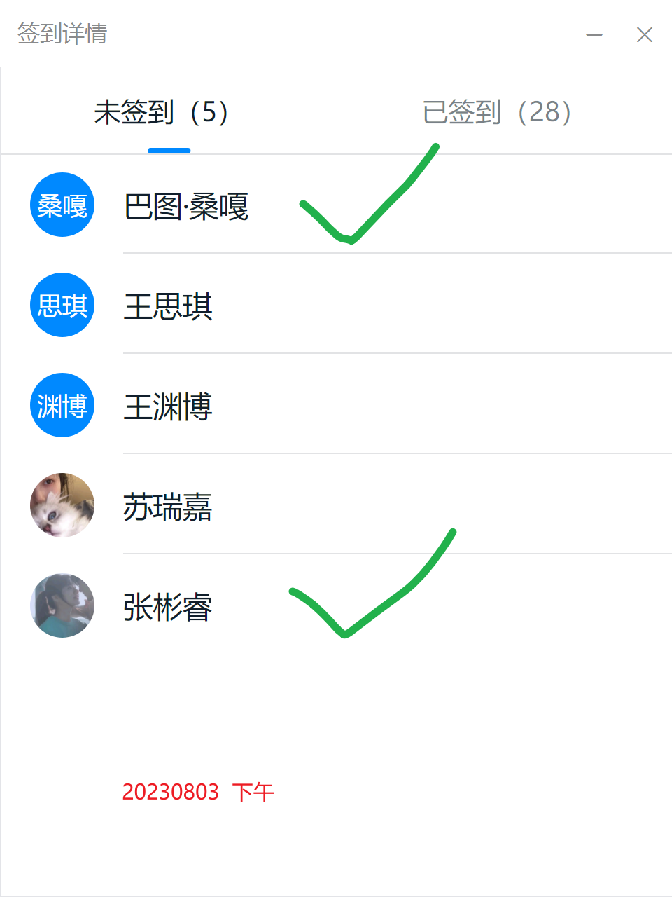


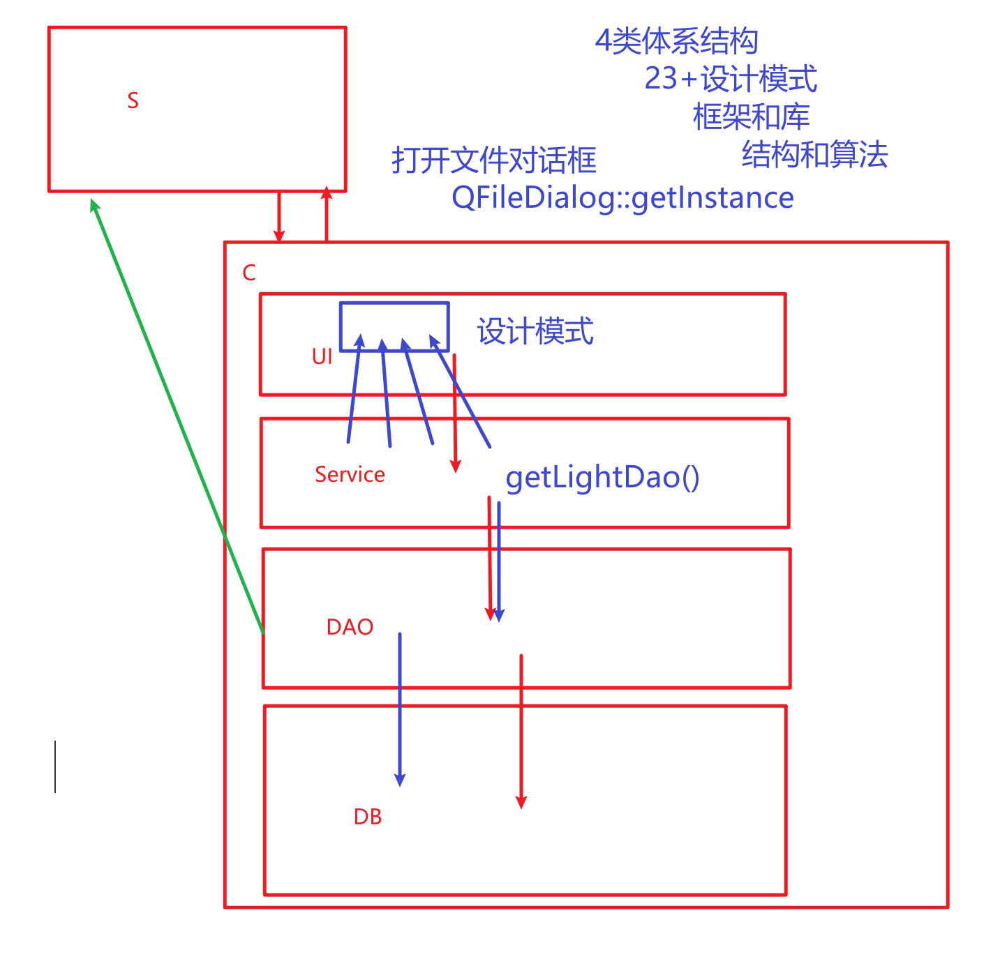


# SQLite

数据库：  传统数据库实现数据的持久化、结构化，追求效率

常见的数据库分类（逻辑体系）：层次，网状，**关系**，**键值对**

常见的数据库分类（工作模式）：C/S模式，**嵌入文件式**，内存


常见的关系型的嵌入文件式数据库   ：    Access【ODBC】   ， SQLite 


SQLite 开源，文件型，适合嵌入式

作为程序访问数据库 加载对应  数据库驱动，一般驱动由数据库厂商实现 ， 驱动的相关接口由框架实现。

Qt中， 关系型数据库的接口被封装在    sql   模块中【QT+=sql】，具体由QSqlDatabase和QSqlQuery接口规范接口规则。

通常对于数据库的操作有：  C增R查U改D删   ，  R查是只读操作，其他三项操作写操作默认会形成事务的自动提交（每行语句执行结束自动commit）

关系型数据库数据之间的关系，通常使用ER（Entry Relational）图表示【一对一，一对多，多对多】

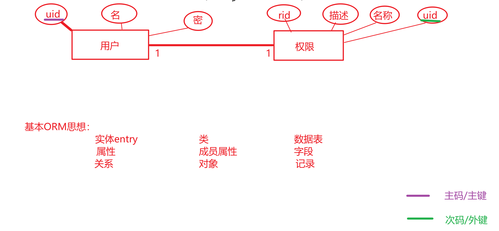

推荐的方式：  数据库的常见DDL由数据库工具实现（建表，建库）， 数据的操作DCL，DML（insert，delete，update，select）由程序完成。

推荐使用：SQLite Expert Personal 5    实现建库建表

```sql
-- 一次性操作在SQL工具完成
-- 创建表结构
create table users(
      uid  int auto_increment,
      username varchar(10),
      passwd  varchar(10)
);
-- 插入初始测试数据
insert into users(username,passwd) values ('zhangsan','123456'),('lisi','654321');
```

## Qt中使用SQLite

1	加载sql模块

```html
QT       += core gui sql
```

2	包含接口类

```c++
#include <QSqlDatabase>
#include <QSqlQuery>
```

3	加载驱动连接数据库

```c++
//验证默认支持的驱动接口
    qDebug() << QSqlDatabase::drivers();

    //通过指定驱动连接数据库
    QSqlDatabase db =  QSqlDatabase::addDatabase("QSQLITE");
    //设置具体的数据库文件路径,如果不存在则创建
    db.setDatabaseName("../sqliteDemo/neu.db");//建议使用发布资源的方式
    //打开数据库
    if(db.open()){
        qDebug() << "数据库打开成功";
        //数据操作
        db.close();
    }else{
        qDebug() << "数据库打开失败";
    }
```


课堂练习： 完成上述步骤


# 当前教师任务：   【1V1指导】

可以文字提问或者   语音连线

如果没有提问者， 对历史文件进行评审，需要点名同学连麦  , 所有成员在线开耳麦


# 当前学员任务： 项目环境搭建


# 课间休息：   14：05


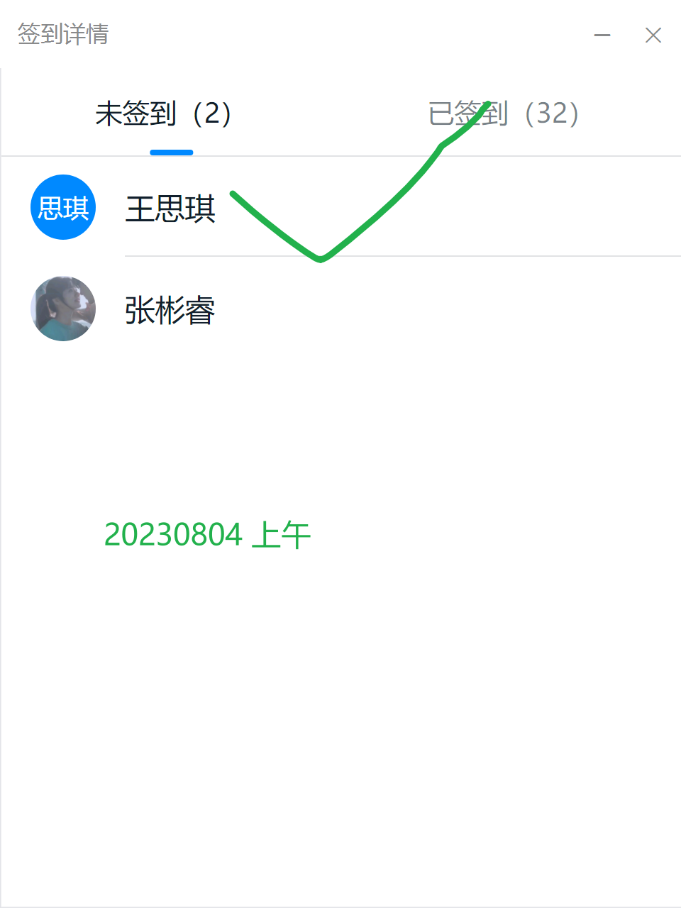


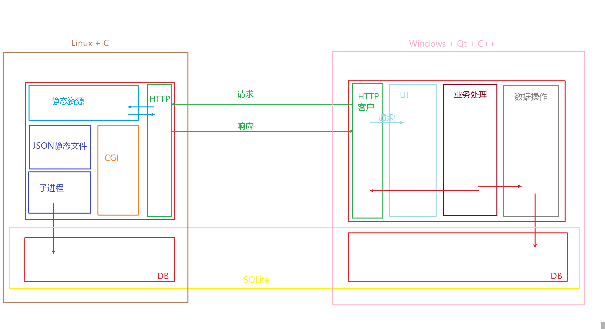


# 课堂练习：    部署开发环境【通过git管理】


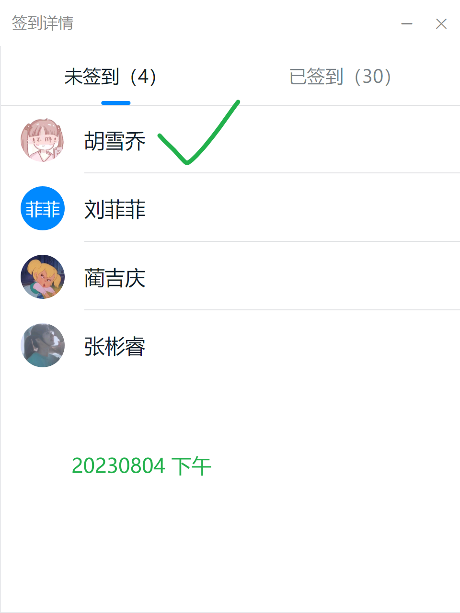


