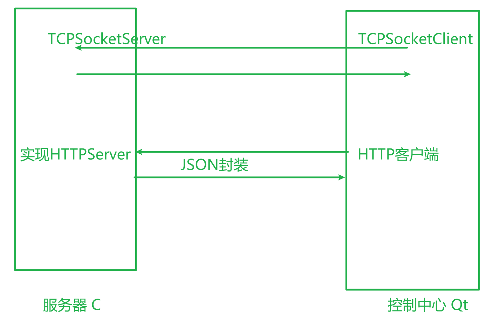
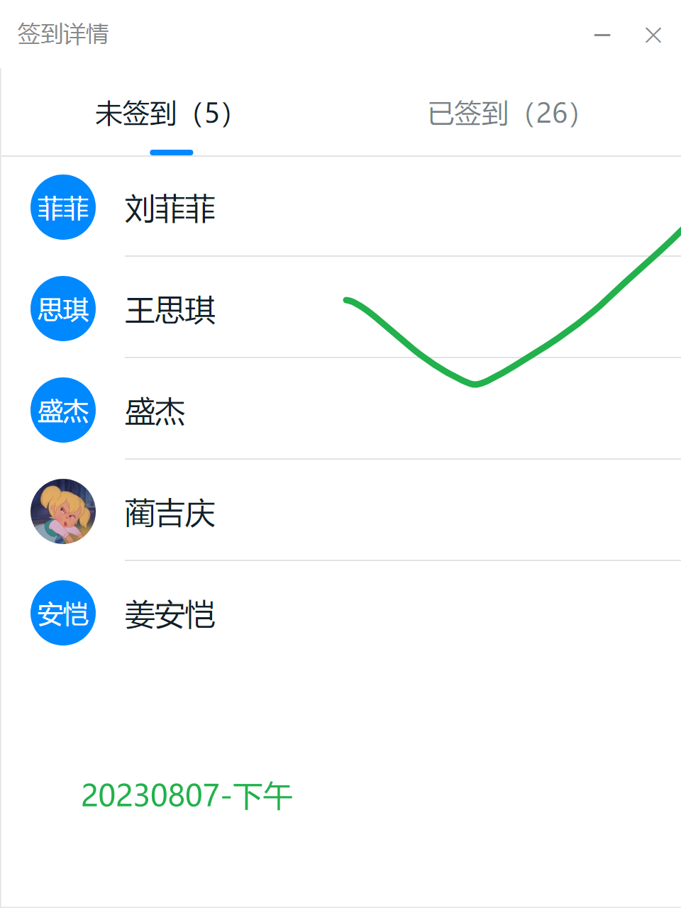
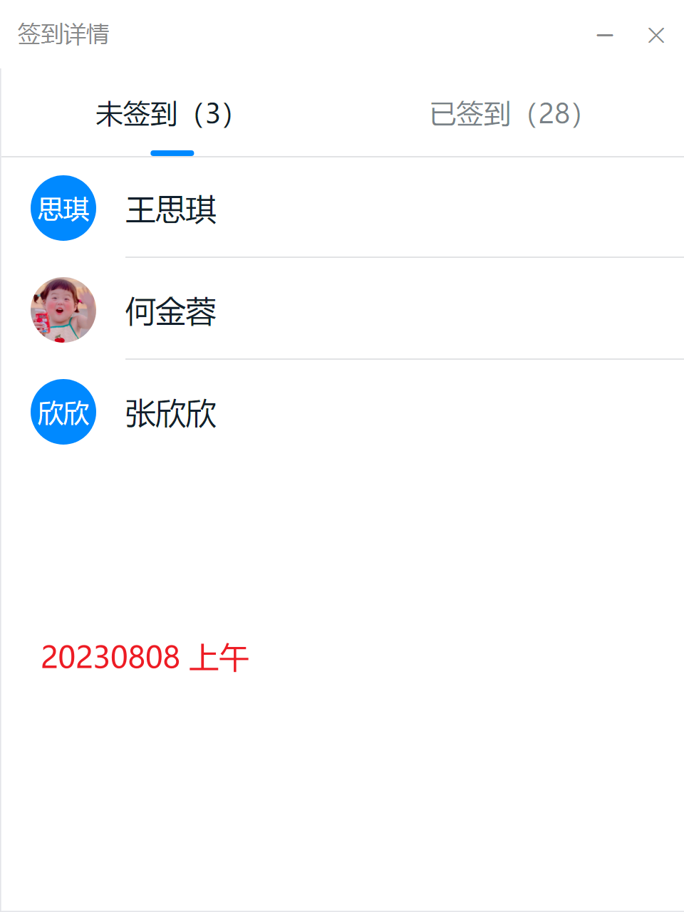

# 上周回顾

需求+设计  ：  项目管理

AI + Git：辅助工具


# 数据通信




标准C++没有提供专门用于套接字的通信类。借助于操作系统提供的C的API完成，Qt将跨平台网络访问封装network模块中

# 课堂练习：   查看服务端代码      到9：55

# 20230807-上午签到     王泽萱  未回应


JSON：javascript对象表示法    ，    目前是通信的标准格式之一


单一数据 99 ，则默认为      {"undefined":99}

支持的数据类型有：

​	数字：     99				3.14

​	字符串：   “内容”

​	布尔值：    true/false

​	数组：       [数组列表]

​	对象：       {key：value}


```json
{
    "name":"wangzhanf",
    "age":18,
    "h":1.77,
    "other":[
        ["football","basketball"],
        {"system":"C","application","Java"}
    ]
}

res.other[1].system     =====   C
```


# 当前教师任务：   【1V1指导】

可以文字提问或者   语音连线

如果没有提问者， 对历史文件进行评审，需要点名同学连麦  , 所有成员在线开耳麦


# 当前学员任务： 编码


# 


# 昨日回顾

网络通信：偏于上层的通信封装的越具体


# 编码规范

## 为何需要代码规范

​	促进团队合作

​	易于维护减少BUG

​	有助于代码审查（走查，评审）

​	有助于自身成长


## 1	目录和文件结构

1.1	工程开发目录和结果目录分离【C开发一个公共的库，开发目录是源文件（xx.c）, 结果目录是二进制的目标文件（xx.o）。   Qt 建议使用影子构建】

1.2	不同的模块独立存放【通过.c  或 .cpp  定义，C++一般一个类是一个独立的模块，C一般一个文件是一个独立模块（利用static实现了模块的封装）】

1.3	文件的命名：语义化命名，遵守8.3原则，每文件不要超过2000行。

1.4	声明.h   和   定义.cpp     分离

1.5	.h  声明文件要进行防多次包含的处理（尽量不要在头文件中包含其他头文件）


## 2	程序格式

2.1	分行， 一行代码不超过80个字符，一般在运算符后换行

2.2	空行分隔，多个函数之间，多个主要逻辑片段之间  使用空格分隔

2.3	大括号推荐原则，函数体的大括号独立成行，语句块的大括号紧随表达式

2.4	空格，适当使用空格分隔代码，增强可读性， 推荐在部分运算符的左右添加空格 （.      ->      []      之间不能有空格）

2.5	缩进， 建议2个或4个字符，嵌套层数尽量不超过4层

2.6	注释，注释写给未来的自己的。  类和函数的注释一定要采用项目（项目经理）给定的模板，避免在注释中使用  ” \u     “字符相关 


## 3	类

3.1	声明顺序：   按public，protected，private  排列

3.2	函数排序：   构造函数，析构函数，成员函数

3.3	成员属性和形参通常使用   m_  或者   a_开头

3.4	变量命名规则：   语义化， 可以使用不同前缀表示作用域， 或者不同前缀表示类型。  

3.5	常量： 所有常量推荐使用const取代宏定义。通常使用全部大写字母表示。


## 4	数据类型

4.1	数据进行算术运算防止越界

4.2	对指针进行算术运算前必须要判断

4.3	推荐使用typedef运算符对结构体进行别名定义

4.4	对于有限集合的表示建议使用枚举方式，好处是语义化编程


## 5	其他

5.1	避免出现     = 和 == 混用，    & 和 &&   混用

5.2	使用短路逻辑运算符时，将最易出现影响给整体结果的条件放在最左侧

5.3	用户内存空间的分配和关闭必须配对。（malloc 和  free成对，new  和  delete）


## 编码规范遵守  一致性原则


# 


# 