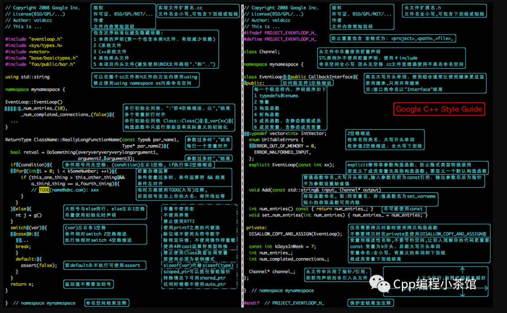
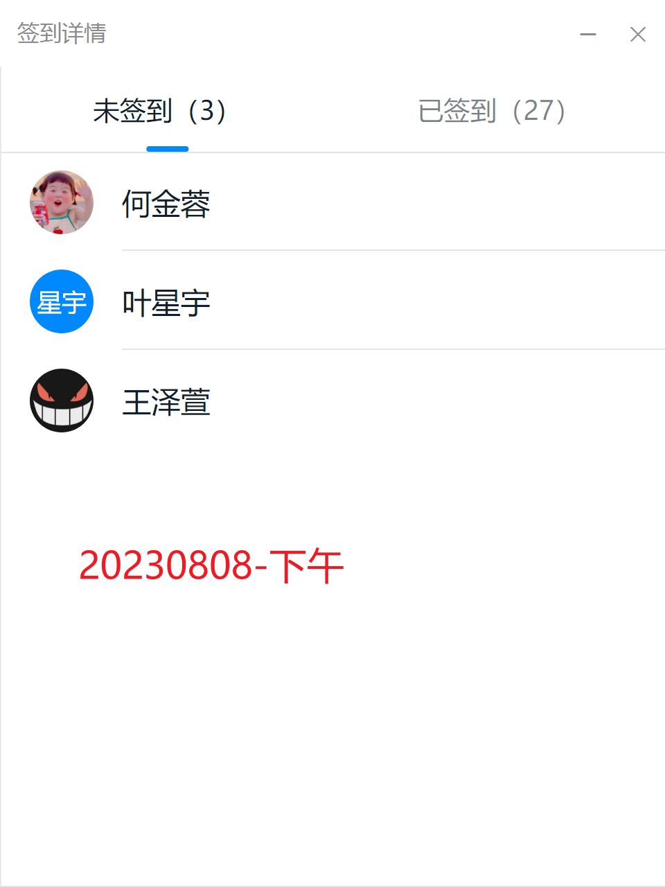
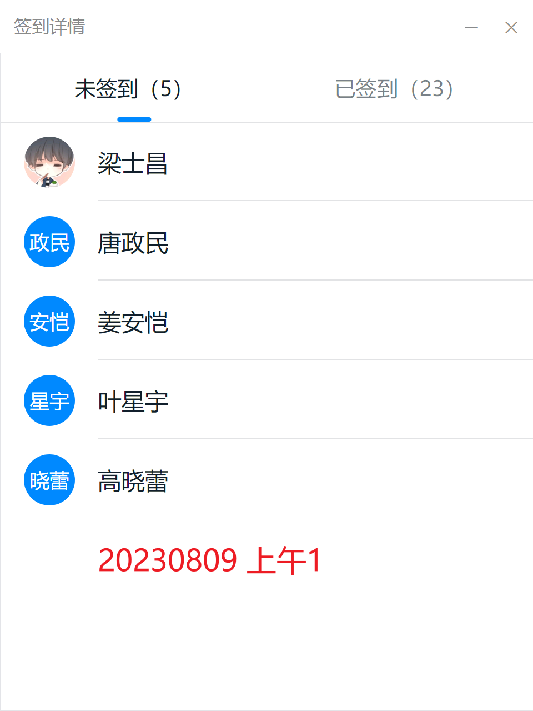
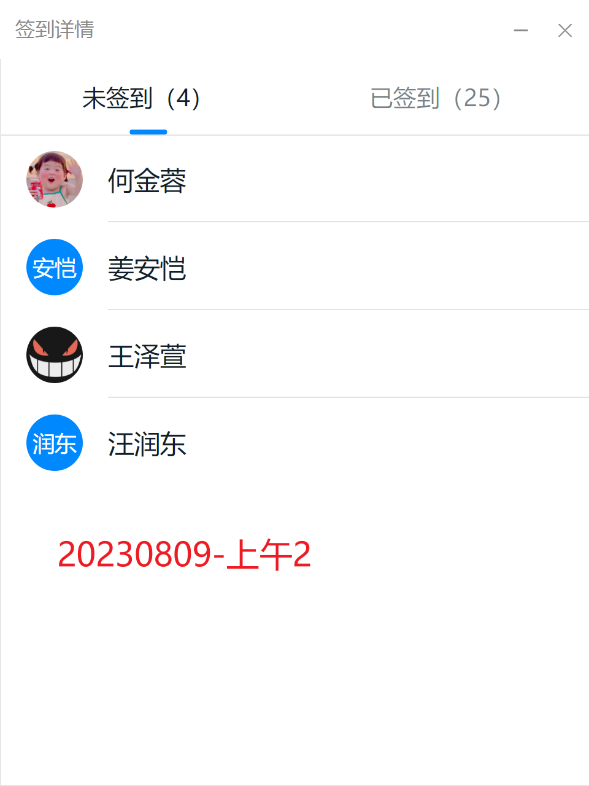
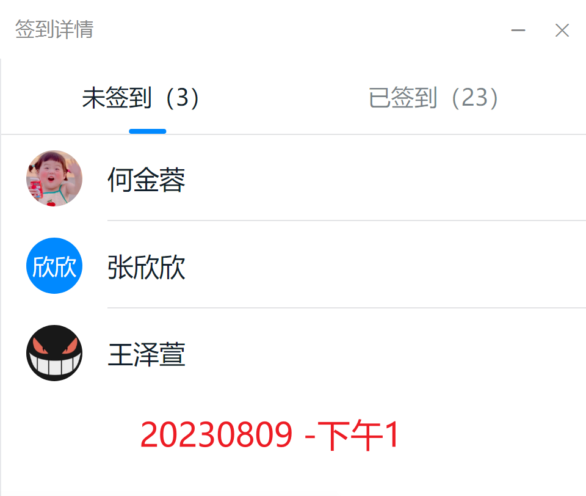
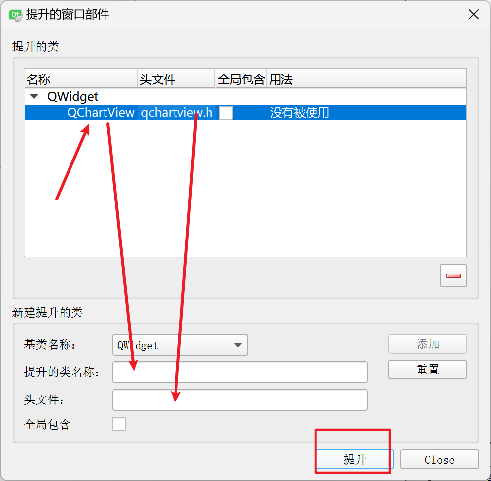
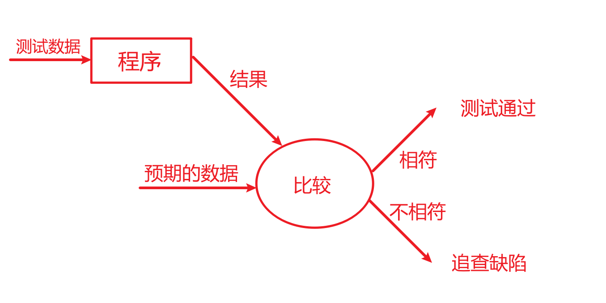
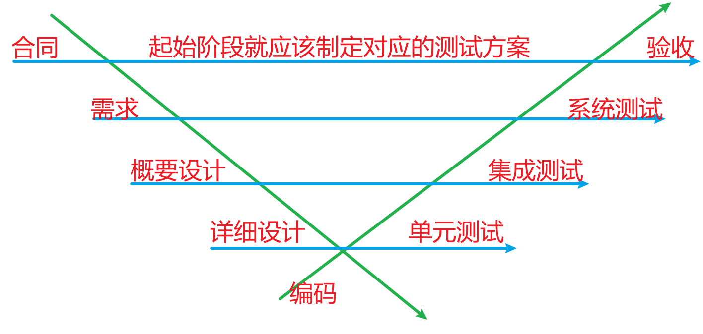

# 上周回顾

需求+设计  ：  项目管理

AI + Git：辅助工具


# 数据通信


标准C++没有提供专门用于套接字的通信类。借助于操作系统提供的C的API完成，Qt将跨平台网络访问封装network模块中

# 课堂练习：   查看服务端代码      到9：55

# 20230807-上午签到     王泽萱  未回应


JSON：javascript对象表示法    ，    目前是通信的标准格式之一


单一数据 99 ，则默认为      {"undefined":99}

支持的数据类型有：

​	数字：     99				3.14

​	字符串：   “内容”

​	布尔值：    true/false

​	数组：       [数组列表]

​	对象：       {key：value}


```json
{
    "name":"wangzhanf",
    "age":18,
    "h":1.77,
    "other":[
        ["football","basketball"],
        {"system":"C","application","Java"}
    ]
}

res.other[1].system     =====   C
```


# 当前教师任务：   【1V1指导】

可以文字提问或者   语音连线

如果没有提问者， 对历史文件进行评审，需要点名同学连麦  , 所有成员在线开耳麦


# 当前学员任务： 编码


# 


# 昨日回顾

网络通信：偏于上层的通信封装的越具体


# 编码规范

## 为何需要代码规范

​	促进团队合作

​	易于维护减少BUG

​	有助于代码审查（走查，评审）

​	有助于自身成长


## 1	目录和文件结构

1.1	工程开发目录和结果目录分离【C开发一个公共的库，开发目录是源文件（xx.c）, 结果目录是二进制的目标文件（xx.o）。   Qt 建议使用影子构建】

1.2	不同的模块独立存放【通过.c  或 .cpp  定义，C++一般一个类是一个独立的模块，C一般一个文件是一个独立模块（利用static实现了模块的封装）】

1.3	文件的命名：语义化命名，遵守8.3原则，每文件不要超过2000行。

1.4	声明.h   和   定义.cpp     分离

1.5	.h  声明文件要进行防多次包含的处理（尽量不要在头文件中包含其他头文件）


## 2	程序格式

2.1	分行， 一行代码不超过80个字符，一般在运算符后换行

2.2	空行分隔，多个函数之间，多个主要逻辑片段之间  使用空格分隔

2.3	大括号推荐原则，函数体的大括号独立成行，语句块的大括号紧随表达式

2.4	空格，适当使用空格分隔代码，增强可读性， 推荐在部分运算符的左右添加空格 （.      ->      []      之间不能有空格）

2.5	缩进， 建议2个或4个字符，嵌套层数尽量不超过4层

2.6	注释，注释写给未来的自己的。  类和函数的注释一定要采用项目（项目经理）给定的模板，避免在注释中使用  ” \u     “字符相关 


## 3	类

3.1	声明顺序：   按public，protected，private  排列

3.2	函数排序：   构造函数，析构函数，成员函数

3.3	成员属性和形参通常使用   m_  或者   a_开头

3.4	变量命名规则：   语义化， 可以使用不同前缀表示作用域， 或者不同前缀表示类型。  

3.5	常量： 所有常量推荐使用const取代宏定义。通常使用全部大写字母表示。


## 4	数据类型

4.1	数据进行算术运算防止越界

4.2	对指针进行算术运算前必须要判断

4.3	推荐使用typedef运算符对结构体进行别名定义

4.4	对于有限集合的表示建议使用枚举方式，好处是语义化编程


## 5	其他

5.1	避免出现     = 和 == 混用，    & 和 &&   混用

5.2	使用短路逻辑运算符时，将最易出现影响给整体结果的条件放在最左侧

5.3	用户内存空间的分配和关闭必须配对。（malloc 和  free成对，new  和  delete）


## 编码规范遵守  一致性原则


# 


# 当前教师任务：   【1V1指导】

可以文字提问或者   语音连线

如果没有提问者， 对历史文件进行评审，需要点名同学连麦  , 所有成员在线开耳麦


# 当前学员任务： 编码







叶星宇       已回应


8月9日下午13：00前，将已完成代码打包   xxxxxx.zip    到   

# 当前教师任务：   【1V1指导】

可以文字提问或者   语音连线

如果没有提问者， 对历史文件进行评审，需要点名同学连麦  , 所有成员在线开耳麦


# 当前学员任务： 编码

# 




梁士昌  有回应




汪润东   有回应


# 当前教师任务：   代码途中评审

可以文字提问或者   语音连线

如果没有提问者， 对历史文件进行评审，需要点名同学连麦  , 所有成员在线开耳麦


# 当前学员任务： 编码





# 当前教师任务：   1V1指导

可以文字提问或者   语音连线

如果没有提问者， 对历史文件进行评审，需要点名同学连麦  , 所有成员在线开耳麦


# 当前学员任务： 编码

重要通知：答辩过程中需要表现项目推进过程中对于AI的研究和思考，关于AI在成果物应该有所体现

# 

# 代码中期评审

1	命名规范，需程序控制的按照语义化命名  【类名和文件名不一致，统一规范】

2	频繁使用   if....elseif...............

3	代码的进度有延误【展期，缩范围，加人手资源，       只能选择      加时间资源——加班】

4	设计约束，部分代码不满足     Qt5    信号和槽的  基本要求

5	代码中无效部分应该删除【包含无用的头文件， 无效的逻辑分支】


# 13：00点之前将代码打包压缩提交至钉钉群文件      “最终代码评审”   目录

# 


# 数据渲染

容器内数据通过图示方式展示

容器：容纳数据 ， 使用  STL   实现  ，选择合适的容器

图示：绘图API  ，  使用  图形库QtCharts  实现   


# 具体实现

## 1	Qt安装了charts

## 2	包含charts库

修改  .pro   文件

```properties
QT += charts
```

## 3	包含对应的头文件

```c++
#include <QtCharts>
QT_CHARTS_USE_NAMESPACE
//using namespace QtCharts;
```


## 4	通过Qt设计师   提升组件




## 5	图表  绑定到   QChartView上

```c++

    //测试创建图表
    QChart* chart = new QChart();//构建图表对象
    QLineSeries* series = new QLineSeries();//构建具体图形类型【容器】
    series->append(1,1);
    series->append(2,2);
    series->append(3,3);
    series->append(4,3);
    series->append(5,2);

    //将容器添加到  图表对象
    chart->addSeries(series);
    // 将图表对象绑定到   已有  可视区域
    chart->setTitle(tr("销售曲线"));
    chart->createDefaultAxes();
    ui->widget->setChart(chart);
```


# 课堂练习：  将项目中需要图示展示部分通过QtCharts实现。【截止10：40】


# 测试

【错误观点】鄙视链：嵌入式 》 C 》 C++ 》Java 》 前端 》 测试

## 软件测试术语

### 1	软件质量

通常 软件    主要制约要素是    范围，进度，成本， 质量  【大项目重视】

质量： 和需求一致的程度。认知到质量没有极限，随着质量的提高成本以指数级提升

如何做好质量：  领导重视，全员参与，选择符合需求的质量标准，指定具体的质量负责人，按照质量管理的流程实施具体活动【制定行之有效的质量规划P，严格执行质量保证D（合规性），实施严格质量控制】

通常软件的质量控制工作主要有   

​	测试：测试的本质就是验证软件是否能达成期望的功能， 可用于软硬件、需求文档

​	评审： 主要是对文档

测试的概念抽象



测试的数据：通过测试用例明确描述

测试用例：  对一项特定的软件产品、功能进行测试任务的描述，内容包括  测试目标  ，测试环境 ，输入数据 ，测试步骤  ， 预期结果 。   

### 2	测试的分类

从程序运行与否的角度：

​	a.	静态测试：  不运行软件，  常用的手段   评审 ， 代码走查、代码检查

​	b.	动态测试： 

对照瀑布开发模型的V型模型【强调了测试】



回归测试：  主要用于自动化测试，将改动的模块和相关模块整合再次测试


冒烟测试：发现极限值，典型破坏性测试【质量成本中的一致性成本】

压力测试：稳定度测试， 极限值的 80%  稳定长久运行。


黑盒测试：功能测试，只关心输入和输出， 结合   等价类划分、边界值分析、因果图、环境路径【QTP，JMeter】

白盒测试：结构测试，逻辑运行机制【cunit，gtest， junit】


### 3	测试的过程

a	测试计划：定宗旨 ，选标准，明确责任和义务，指导后续工作的开展

b	用例设计：测试执行的条目【结合需求文档编写】

c	测试执行：通过评审的计划和用例指导执行，  功能测试、性能测试、兼容性测试

d	测试总结：组织过程资产的累积【经验教训】


## 测试用例

### 1	测试用例的特性

a	代表性：能够代表并覆盖各种情况【合理和不合理，边界和越界】

b	针对性：对程序中可能存在的错误针对性测试，例如  考试分数【-9，101】

c	可判定性： 执行的结果的正确性是可判断的。

d	可重现性：同样的用例，结果应当是相同的。


### 2	测试用例编写的方法

a	等价类划分法：  测试数据选择可以有效的和无效的代表表现，  年龄有效  50，年龄无效  -1

b	边界值分析法：包含的数据  边界内临近边界的和刚越过边界的值  

c	场景法： 描绘一个基本流（无任何差错，从开始到结束的最简单路径），例外的情况通过备选流  


# 当前教师任务：   代码终审

可以文字提问或者   语音连线

如果没有提问者， 对历史文件进行评审，需要点名同学连麦  , 所有成员在线开耳麦


# 当前学员任务： 编码+测试式样书

重要通知：答辩过程中需要表现项目推进过程中对于AI的研究和思考，关于AI在成果物应该有所体现


