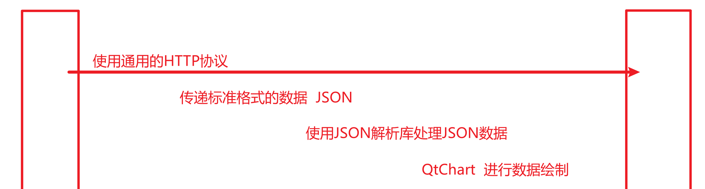
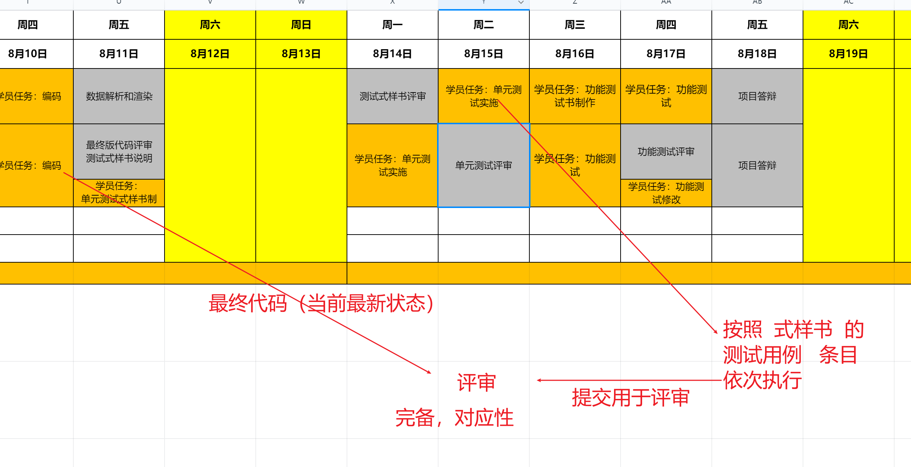
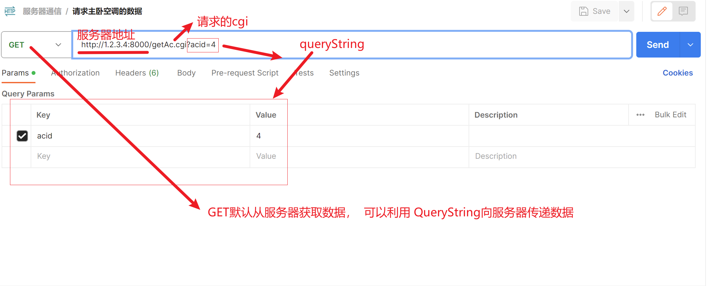
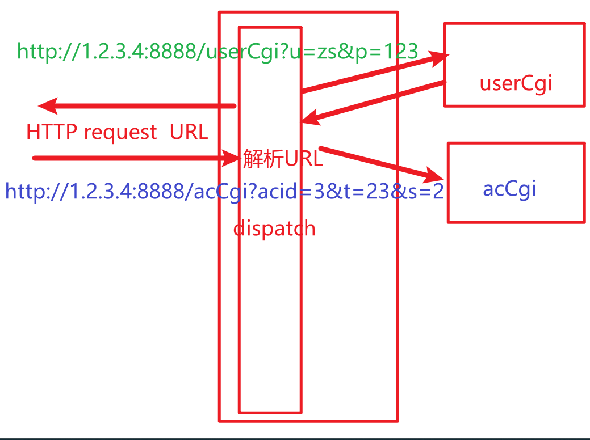
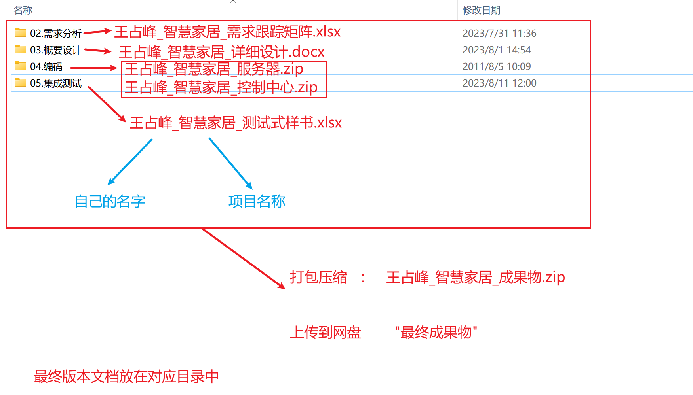
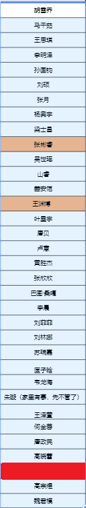

# 

1	及时提交  “单元测试式样书”  文档  ，   便于评审

2	补交作业及文档  需要通知到代课教师【钉钉群】

# 上周回顾

业务实现：  数据通信，  数据解析和渲染

质量工作：编码规范【一致性，语义化】，检查和走查，评审，测试

# 测试式样书评审

1	共同的步骤可以抽取出来

2	描述做到明确，无歧义

3	测试覆盖度合适，借助于工具缩小范围【spinBox组件取代lineEdit，mask限制输入，validate校验输入数据】

4	测试和需求不能混淆

5	编写测试用例，自己的身份定位是软件测试人员角度【不是开发人员】

# 当前教师任务：   1V1指导（评审测试式样书）

可以文字提问或者   语音连线

如果没有提问者， 对历史文件进行评审，需要点名同学连麦  , 所有成员在线开耳麦

# 当前学员任务： 编码+执行测试

重要通知：答辩过程中需要表现项目推进过程中对于AI的研究和思考，关于AI在成果物应该有所体现

注意：项目变更按照变更流程执行，对应的文档更新。    不要忘记  每天更新  《需求跟踪矩阵》

# 

20230815    上午签到，   唐政民     有回应

# 功能测试

对软件产品各项功能，根据测试用例检测，以确保达成了用户需求

通常需求被分为：  功能需求，非功能需求，设计约束

功能测试 就是俗称的    黑盒测试（数据驱动测试）

功能测试 更适合于采用   测试脚本   进行自动化的测试。

使用接口测试工具测试服务器和客户端的交互

1	浏览器的调试工具

2	使用接口测试工具postman【适合于网络测试，特别HTTP】  ，  更适合用作自动化的回归测试

https://www.postman.com/downloads/

# 课堂练习：   从官网下载postman将客户端和服务器交互的接口通过postman编辑为独立的测试条目，然后批量执行测试【截止14：00】

api   接口地址     https://api.aa1.cn/

可以适当并行， 编写代码的时候进行调试  ，  同时进行单元测试  。

功能测试，本质上  黑盒测试/数据驱动测试    ，  无需独立的《功能测试书》，补充填写   控制端和服务器   通信接口的   测试用例。

服务器【基于socket的TCP通信， 基于socket的文件流，基于HTTP通用协议】，可以通过   telnet    或者    浏览器调试器   或者     postman（apipost）  

客户端的功能 ：   点测       

通信功能：            工具（批量执行测试用例--方便  回归测试 ）

## 测试式样书的更新【课堂任务 截止  10：00】

将控制端 和  服务器   进行交互的接口补充测试用例

| 编号 | 测试方法                                                     | 期望结果                                                     |
| ---- | ------------------------------------------------------------ | ------------------------------------------------------------ |
| 101  | 通过postman创建一个get类型的http条目，访问的url地址为   http://1.2.3.4:8888/userCgi   , 查询字串  “u=zs&p=123” | { "code":"1", "data":[ {"riqi":"周一", "wendu":"23～30", "tianqi":"晴", "fengdu":"北风-4-5级", "pm":"优" } |
| 102  | 通过postman创建一个get类型的http条目，访问空的url地址为   http://1.2.3.4:8888/errCgi  , 查询字串  “msg=hello” | 返回  404 错误                                               |

# 答辩

每人答辩的时间：   8分钟  左右（1分钟之内）

答辩开始时间：    8月18日   9：00   开始

答辩的内容： 项目背景介绍 ， 满足了哪些需求   ，进行了哪些设计   ，采用了哪些AI辅助编程手段以及对AI编程的个人认知，产品核心功能运行展示  ，  总结。（不强制使用PPT）

答辩的方式：腾讯会议方式      

点击链接入会，或添加至会议列表：
https://meeting.tencent.com/dm/HZDwTweQsG7T

#腾讯会议：558-574-494

答辩人连麦 + 开启摄像头 + 共享桌面（强调是桌面）+ 同时共享电脑声音

答辩结束回答完教师提问问题可以结束共享

整体资料提交【截止8月18日    23：59】：

答辩的顺序：

